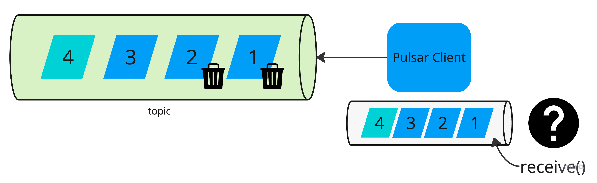

When adding new technologies to our portfolio, we spend some time experimenting with its core features to "eliminate guesswork". The more advanced the tool, the more time we need to discover its behaviours. Working with [Apache Pulsar](https://pulsar.apache.org/), a distributed streaming platform, we explore event-steaming architecture whose complexity requires us to verify empirically many aspects.

This is exactly how we approached the next challenge, which was to read only the latest messages for a given key from the topic. In our case, these are `published pages`, of which only the latest versions are processed. A similar situation may apply to `stock exchange data`, where we are only interested in the current prices of listed companies.

The mechanism that "cleans up" the old messages per key is called [topic compaction](https://pulsar.apache.org/docs/3.0.x/concepts-topic-compaction/). Once a topic compaction completes, all consumers assigned with active subscriptions should receive only the latest messages per key.

With such a scenario, our test should:
- produce the appropriate number of messages with the same keys and send them to the topic
- invoke the compacting mechanism on the topic
- wait for the compaction to finish
- read the next message on the consumer

Our code looks like:

```java
Producer<String> producer = newProducer(topicName);

producer.newMessage().value("1").key("A").send();
producer.newMessage().value("2").key("A").send();
producer.newMessage().value("3").key("A").send();
producer.newMessage().value("4").key("B").send();

Consumer<String> consumer = newConsumer(topicName, "unit-test")
    .readCompacted(Boolean.TRUE)
    .subscribe();

waitUntilCompacted(topicName);

assertNextMessageValue("3", consumer);
assertNextMessageValue("4", consumer);
```

We expected that only the compacted data would be available to the consumer after compaction was complete. But the tests result was different:

```
Expecting: 3
Consumed: 190:0:-1:0 value: 1
```

Our hypothesis formed based on Pulsar documentation seemed wrong. We immediately remembered the Richard Feynman words:

> If your guess disagrees with experiment, then it (your guess) is wrong!


We spent more time experimenting with our failing test. We quickly discovered that the Pulsar client has a prefetch mechanism that downloads events from the topic in larger batches. By default, the client downloads `1000` messages at a time, and each time `receive()` is called, we get a message previously downloaded from the topic. Although after compacting the topic, the messages may already be "stale". 

To limit this behavior we can configure the `receiverQueueSize(int receiverQueueSize)` option on the consumer:

> The consumer receive queue controls how many messages can be accumulated by the Consumer before the application calls Consumer.receive(). Using a higher value could potentially increase the consumer throughput at the expense of bigger memory utilization.

For the purpose of testing and learning about Pulsar, we recommend setting this value to `1`. This will ensure that only the first event is "stale".

```java
Producer<String> producer = newProducer(topicName);

producer.newMessage().value("1").key("A").send();
producer.newMessage().value("2").key("A").send();
producer.newMessage().value("3").key("A").send();
producer.newMessage().value("4").key("B").send();

Consumer<String> consumer = newConsumer(topicName, "unit-test")
    .readCompacted(Boolean.TRUE)
    .receiverQueueSize(1)
    .subscribe();

waitUntilCompacted(topicName);

assertNextMessageValue("1", consumer);
assertNextMessageValue("3", consumer);
assertNextMessageValue("4", consumer);
```

Our modified test case was successful. We experimentally proved our expectations regarding the compaction mechanism.

More details [here](https://github.com/handsonarchitects/sandbox/blob/main/pulsar/src/test/java/com/handsonarchitects/pulsar/PulsarClientReceiverQueueSize.java).
