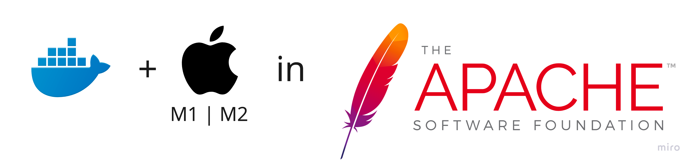

With new M1 / M2 MacBooks from Apple, the "new" `arm64` architecture began to dominate the laptop market. In this short article, we describe how developers could help the open-source ecosystem to adopt their Docker images to the new platforms.

Developers with M1 / M2 MacBooks using Docker need support for the new `arm64` architecture processors. For project maintainers, it means that instead of a single `amd64` platform image, they must build several once for `amd64` / `arm64` platforms. It requires adopting their current CI tools to build multiple images and expose them within a single Docker manifest (under a specific tag name). This process is time-consuming and requires much effort, especially in open-source world. 

With [Robert Munteanu](https://github.com/rombert) from Adobe, we adopted one of [Apache Software Foundation](https://www.apache.org/)'s (ASF) projects, [Apache Sling Starter](https://github.com/apache/sling-org-apache-sling-starter), to the new multi-arch support procedure.

It required the following steps:

1. Create an [Apache JIRA issue](https://issues.apache.org/jira/browse) asking for M1 Docker images support e.g. [SLING-11714](https://issues.apache.org/jira/browse/SLING-11714)

2. Agree with the ASF project owner to use [GitHub Actions workflows](https://github.com/features/actions) that have the support for [docker buildx](https://docs.docker.com/engine/reference/commandline/buildx/):
> I would suggest using GitHub Actions, there you can use the official suite of docker actions to build multiplatform images with little need for custom scripting [1].
<small>source: https://lists.apache.org/thread/xd3p8nom68gkgjmjpgfylh0vyx260s5o</small>

3. Provide PRs with a working solution (in our case, we use [Docker Maven Plugin](https://github.com/fabric8io/docker-maven-plugin) to manage `buildx` container that builds and pushes images):
   - https://github.com/apache/sling-org-apache-sling-starter/commit/1b879e7eec280e1bd20a4bc1e247f29604f26294
   - https://github.com/apache/sling-org-apache-sling-starter/commit/39e9cd35e5b4bb0c4a639fe42950555ca03f05c3
   - https://github.com/apache/sling-org-apache-sling-starter/commit/019999478ab600ab0aef111aac110f44f8a19bdb

4. The Apache project owner needs to raise an issue to Apache Software Foundation infrastructure team to enable GH actions secrets for pushing docker hub images e.g [INFRA-23983](https://issues.apache.org/jira/browse/INFRA-23983).

5. Once all ready, PRs can be merged.

Summarizing, adding support for the `arm64` platform in open-source projects is not a complex work. Satisfaction from being the [ASF contributor](https://github.com/apache/sling-org-apache-sling-starter/graphs/contributors) is worth spending a few hours after your everyday routines.