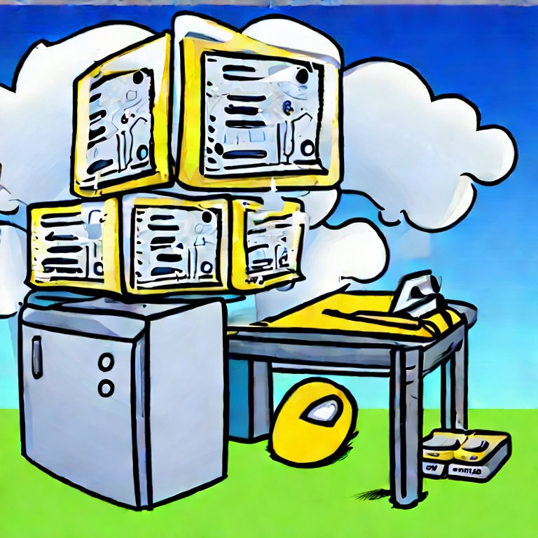
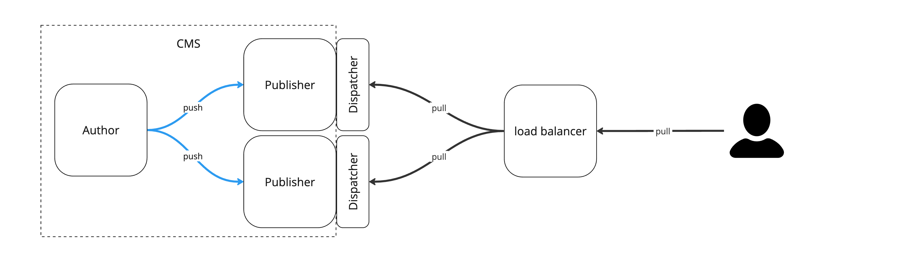
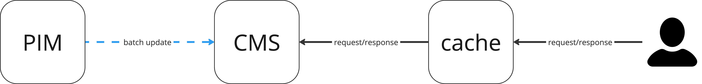
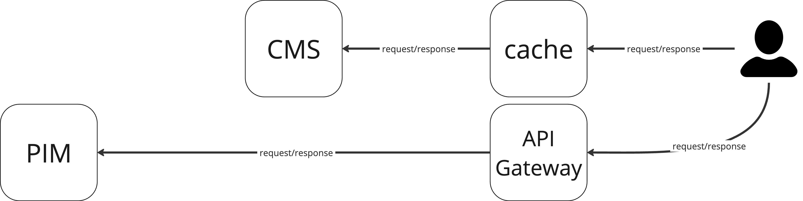

During my last [presentation at AdaptTo() 2023](/2023/how-to-sleep-well-at-night-when-your-production-cms-is-down/#recording), I mentioned reference content-centric architectures and how they leverage caching. In this blog post, I will expand on this topic.

## Content-centric architectures

Content-centric architectures are a common approach to building web applications. The content is the most important part of the application, and a central repository stores it.

An example of a content-centric architecture is a platform built around the Content Management System (CMS). In such a case, the CMS is the single source of truth of all integrations work through it.

While this approach has advantages, it also has some drawbacks. In this blog, we will focus on one of them - dealing with a high volume of changing data like product information.

## Content-centric caching

In the case of content-centric applications, caching usually happens between the CMS and the end user, and it is usually a read-through cache with a time-to-live (TTL) invalidation strategy.

For example, in the Adobe Experience Manager (AEM), the caching happens on the Dispatcher level (Apache Server module). The Dispatcher proxies the request to AEM, caches the responses, and serves them to the end users.

## Sample solutions

To make things more clear, let's work with some example. We will use a simple Product Details Page reference. The solution involves the CMS, which is the source of content and layouts of pages. Product Information Management (PIM) system is the source of product data presented on the product pages.

Below, you can find three examples of content-centric architectures that enable displaying product data on the Product Details Page.

### Batch updates

Batch updates are one of the most popular PDP solutions. The CMS is the single source of truth responsible for rendering the PDPs. The CMS integrates with PIM via batch updates executed on a regular basis. CMS storage duplicates the data from PIM. That enables PDPs rendering with no additional callbacks to PIM (PIM is not taking part in end users' requests). The trade-off is that the information on PDP pages is outdated. That might or might not be a problem, depending on the requirement on how often PDPs should change.

This solution works well when the data in PIM changes rarely, and most of the page responses come from the cache. In such cases the batch updates can be scheduled to run once a day, or even less often. Another problem could be the volume of products. When using a cache warm-up, rendering several tens of thousands of PDPs could take up to a couple of hours. The real problem starts when the products need to be updated every time they change in PIM within a short period of time (e.g., 15 minutes) - which was the case in one of our projects in the past.

### Backend integration

The concept behind this approach is straightforward: the CMS takes on the role of rendering PDPs. In this configuration, the CMS is directly linked with the Product Information Management (PIM) system, pulling data from the PIM at regular intervals, typically triggered by user requests reaching the PIM.

Directing user traffic to the PIM usually requires an additional caching layer (between CMS and PIM), introducing complexity into the platform. Furthermore, the activities of the PIM and CMS teams must be synchronized. For example, PIM updates may temporarily prevent CMS authors from publishing PDP pages because it will clear the cache.
Techniques like cache warm-up and advanced cache invalidation are often employed in this context. 

This method is most effective when dealing with a modest volume of products and when the PIM can effectively handle the incoming traffic.

### Frontend integration

While CMS still maintains a central role, its responsibility for rendering  PDPs has shifted. Instead of PDP rendering, the CMS provides templates (e.g., with ReactJS components), and the actual assembly of pages occurs within the user's browser. This transition results in the PIM system exposition to direct user traffic, which necessitates the implementation of additional caching mechanisms, typically achieved through an API Gateway.

In short words, a significant portion of product-related caching has been transferred to the API Gateway, making it a crucial part of the caching strategy.

It's important to note that assembling pages on the front end introduces trade-offs in User Experience (UX), especially when dealing with a substantial volume of products.

## Summary

We have seen three different approaches to producing product detail pages with data from two different sources: CMS and PIM. Each of the solutions depends on caching.

- In the context of caching, batch updates are the simplest to implement, but they might contain outdated data.
- The backend integration serves the latest data but requires additional caching and synchronization between PIM and CMS.
- Finally, the frontend integration with fresh data comes at the cost of an additional caching mechanism for PIM (e.g., API Gateway) and trade-offs on the UX (especially when we talk about a high volume of products).

## Resources

We highly recommend `D4Debugging` blogpost [Application Caching Strategies](https://dfordebugging.wordpress.com/2022/08/17/database-caching-strategies/). It is a great read on caching strategies that nicely summarizes the topic.

For the presentation from AdaptTo() 2023, [the part about referential solutions starts around ~6:40 minute](https://youtu.be/uqwmu_kMHcQ?t=404).
