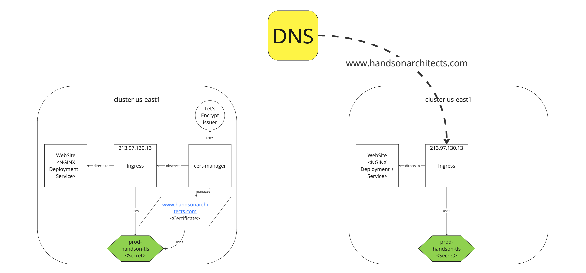
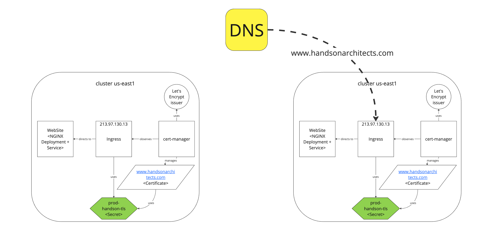

In this brief note, we will share a simple way to migrate a website that uses the [Let's Encrypt certificate](https://letsencrypt.org/) from one Kubernetes cluster to another with no downtime.

## Starting point


We start with a Kubernetes cluster that contains the current website in the USA region.

The important thing to notice is the [cert-manager](https://github.com/cert-manager/cert-manager) installed via Helm configured on the cluster with the Let's Encrypt ACME production issuer.

The issuer is triggered by the ingress-shim annotation `cert-manager.io/issuer`:

```yaml
apiVersion: networking.k8s.io/v1
kind: Ingress
metadata:
  # ...
  annotations:
    kubernetes.io/ingress.class: nginx
    cert-manager.io/issuer: "handsonarchitects-letsencrypt-prod"
  labels:
  # ...
spec:
  tls:
    - hosts:
        - www.handsonarchitects.com
        - handsonarchitects.com
      secretName: prod-handsonarchitects-tls
  rules:
    - host: www.handsonarchitects.com
      # ....
    - host: handsonarchitects.com
      # ....
```

As a consequence of `cert-manager` work, the `CertificateRequest` resource is created and finally, the `Certificate` and `Secret` are obtained and saved.

## Migration

Now, we will deploy the application on the newly created cluster in Europe. All that we need to install on the fresh instance are Nginx Deployment, Service and Ingress.


To support SSL we can copy the `prod-handsonarchitects-tls` certificate Secret from the old cluster:

```bash
# us-east1 cluster
kubectl get secrets prod-handsonarchitects-tls -o yaml > prod-handsonarchitects-tls.yaml
```

and apply it in the Ingress's `tls.secretName` of the new cluster:

```bash
# eu-central2 cluster
kubectl apply -f prod-handsonarchitects-tls.yaml
```

> Note that at this moment the cluster should not request certificates automatically as the DNS does not point to it. Producing requests by the issuer might quickly drain the [Let's Encrypt certificate requests quota](https://letsencrypt.org/docs/rate-limits/).

At this moment, the website should be working with the certificate and you may confirm it by adjusting your `/etc/hosts` with:

```
213.97.130.13 www.handsonarchitects.com
```

> _Tip: Certificate renewal_
> 
> Let's encrypt certificates are usually issued for 90 days. If you need to renew the certificate before the migration there is a very nice tool for you: https://cert-manager.io/docs/reference/cmctl/#renew
> 
> It enables to manually trigger the certificate renewal by running this simple command: `mctl renew prod-handsonarchitects-tls`

## DNS switch
Now we can safely switch the DNS to point the new cluster, as we have a working website with the certificate.



Remember, that DNS switching might take up to 24h to propagate. But this is not a problem, since you have mirrored clusters with your application.

## Cert-manager installation


The last step is installing the `cert-manager` on EU cluser:

```bash
helm upgrade --install cert-manager cert-manager \
  --repo https://charts.jetstack.io \
  --set installCRDs=true \
  --namespace cert-manager \
  --create-namespace
```

At this moment, the copied Secret will match the `Certificate` and all should work fine.

Also, you may remove the old cluster safely.


## Summary

In this short note, we migrated the static website from one Kubernetes cluster to another, while using the free Let's Encrypt SSL certificate and the `cert-manager`. We were able to keep the website online for the whole process of the migration.