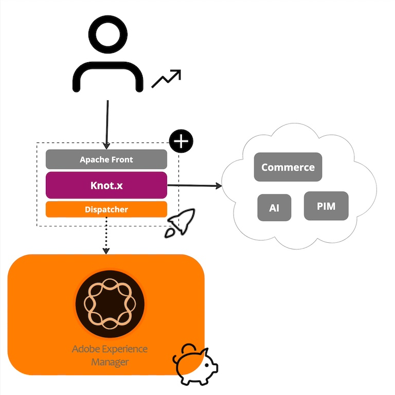

Knot.x acts as a pivotal integration layer that molds customer experiences across diverse channels by blending content and style from Adobe Experience Manager with data sourced from various repositories such as Product Information Management (PIM), Commerce, or Customer Relationship Management (CRM) systems. This integration layer enabled Cognifide / Wunderman Thompson Technology to develop sophisticated personalized "dynamic" websites for global brands, thereby reshaping the architecture from AEM-centric to fully composable. Knot.x revolutionized the creation of product listing pages, product details pages, search result displays, and the dynamic adjustment of related content components like tagged content fragments/pages, blog listings, sitemaps, and navigations. Its impact on server-side generated sites was groundbreaking from developmental, infrastructural, and cost (AEM licenses) perspectives. Our solution was widely embraced across over 10 projects, including several platforms hosting more than 400 brand sites. We shared our insights and concepts at various industry events such as GeeCon, Devoxx, and numerous local tech gatherings. This article encapsulates both the technical and business rationales behind the inception of Knot.x in 2017.

A major consideration was financial concerns. AEM licenses (on-premises) come at a significant cost, and reducing the number of AEM Publish instances yields substantial savings. Decreasing the number of Publish instances from 10+ to 2 was a transformative step for both international and regional brands. This transition was made possible by redefining responsibilities within AEM. Instead of housing all business logic and integrations within OSGi in AEM, we utilized AEM solely for generating static pages. Dynamic page fragments were shifted to Knot.x, a highly efficient reactive integration layer. Once a page was generated by AEM Publish, it was cached at AEM Dispatcher, eliminating the need for Dispatcher invalidations. This streamlined scalability, requiring only the addition of more Knot.x-Dispatcher pairs.

Another critical focus was enhancing page rendering speed. Initially, we leveraged static pages from AEM Dispatcher, incorporating dynamic fragments like product details, ratings, prices, cart items, or personalized offers. We utilized highly efficient JVM-based technology to process these fragments and populate them with data sourced from various repositories like PIM, Commerce, or CRM. Tasks that were typically handled by AEM Publish, thus limiting the effectiveness of Dispatcher caching, were now delegated to an external, highly efficient integration layer. This layer required significantly less CPU and RAM and was designed for asynchronous processing, ensuring stable performance even during peak loads such as marketing campaigns. One significant outcome was notable savings on infrastructure costs. Instead of deploying numerous AEM Publish instances requiring substantial CPU and RAM resources, we implemented 2-4 lightweight boxes with lower resource demands, often incorporating AEM Dispatcher as well. In summary, this approach led to potentially several-fold reductions in infrastructure costs for AEM-based platforms compared to traditional methods.

Yet another crucial factor in AEM projects is development effort and associated costs. With Knot.x, all integration logic was moved outside of AEM, allowing us to execute projects with fewer AEM developers, who tend to be quite expensive. Furthermore, we streamlined development efforts by introducing "no-code" JSON-based integrations with built-in stability patterns, such as circuit breakers, API caching techniques, API fallback strategies, sequenced API invocations, and more. While these techniques support RESTful API integrations, not all developers can effectively utilize them without guidance. Hence, we provided engineers with a configurable toolset to address integration challenges, not only during successful execution but also in the event of failures, such as temporary unavailability of APIs. Additionally, by transitioning from Jetty (AEM) to Netty (Vert.x), we provided developers with another significant advantage. This shift eliminated the need to delve into large thread pools typical of traditional multithreaded systems, enabling developers to code integration logic within a simplified concurrency model akin to technologies like NodeJS. This asynchronous, simplified model has proven to be exceptionally performant.

The final, but equally important, rationale for adopting Knot.x in projects was the absence of vendor lock-in. Despite the array of solutions within the Adobe Experience Cloud, such as Adobe Analytics, Adobe Audience Manager, Adobe Commerce, Adobe Target, Adobe Campaign, and others, our clients often preferred to retain their own solutions rather than migrating their entire business to a single vendor. Thus, with Knot.x, we were able to incorporate various integrations, such as Apache Solr, custom personalization engines, Commerces, PIMs, and more. This flexibility allowed us to select the best tools for solving specific problems, rather than being confined to Adobe's offerings.

In summary, we implemented Knot.x in 2017 to tackle various challenges faced by our clients using AEM. By introducing an external integration layer, we effectively tackled issues related to licenses, infrastructure, and development costs. Additionally, we provided our clients with a highly adaptable platform, allowing them to seamlessly incorporate their own solutions. Knot.x continues to be extensively utilized by our clients under the VML brand to this day.
