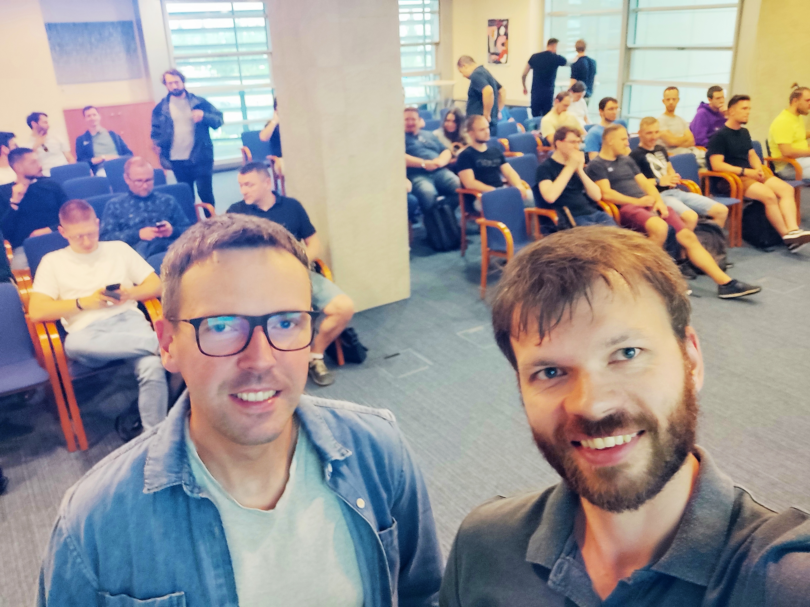

After a short break from blogging, we are back with fresh insights from our recent presentation at the [Poznań Java User Group on May 22nd](https://www.meetup.com/pl-PL/poznan-java-user-group/events/300745537/). The topic? A practical approach to software lifecycle optimization for Java applications within complex systems. The session was well-received, underscoring the growing interest in integrating DevOps practices within the Java community.

Despite a late start (just after 8 p.m.) following a full working day, we were positively surprised by the audience's enthusiasm and involvement. The session concluded with an almost 20-minute Q&A, reflecting the high level of engagement. The presentation covered three critical areas: working effectively with complex systems in development environments, continuous integration, and a comprehensive approach to testing, including unit, integration, and end-to-end testing.

A key takeaway was the positive reception of DevOps principles by the Java developers in Poznań. The audience's insightful questions and active participation demonstrated a keen interest in adopting and refining these practices to enhance productivity and efficiency. During the presentation, we showcased several DevOps tools such as LensIDE, Kind, and GitHub Actions, which sparked significant interest and curiosity among attendees. Many questions revolved around the practical implementation of these tools and their integration into the software development lifecycle.

Although the presentation was not focused on the Java language itself, the feedback and interactions from this event have been incredibly encouraging. It’s clear that there is a vibrant and eager community ready to explore these topics. We are excited about the possibility of bringing this discussion to other forums and user groups, fostering a broader conversation around optimizing the software lifecycle for Java and other communities.

Stay tuned for more insights and updates as we continue to explore and share best practices in software development and DevOps. Thank you to the Poznań Java User Group for hosting such an inspiring event and to all the participants for their enthusiastic involvement. We look forward to more enlightening sessions in the future!