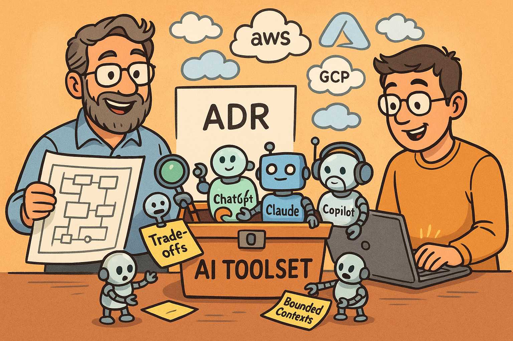

Artificial intelligence has become a daily companion for many software architects. In 2025, it is less about “choosing the best AI tool” and more about **curating and evolving a living toolset**. No single platform covers all needs - at least not yet. Instead, we must constantly experiment, combine, and adapt AI capabilities to support architecture design, technical leadership, and delivery in ever-changing environments.

This post outlines how we use AI tools in our practice, along with examples of how they support the software architect role.

## **The Architect’s Role and AI Support**

Software architects are expected to:

* **Shape system design** by balancing business requirements, constraints, and technical trade-offs.
* **Guide teams** in applying architectural principles and patterns across distributed, cloud-native, and DevOps contexts.
* **Bridge communication** between engineering, leadership, and business stakeholders.

AI tools do not replace these responsibilities. Instead, they provide **acceleration, augmentation, and reflection**:

* Acceleration: speeding up research, prototyping, and documentation.
* Augmentation: extending reasoning, generating options, and exploring trade-offs.
* Reflection: providing different perspectives on decisions and assumptions.

## **Categories of AI Tools for Architects**

### **1. Searching & Learning**

* [Perplexity.ai](https://www.perplexity.ai/) – quick search across sources, exploring new technologies, and summarizing new research.
* Useful for: learning about the latest AWS/Azure/GCP services, validating assumptions against documentation, forums, and the broader web.

### **2. Brainstorming & Ideation**

* [ChatGPT (GPT-5)](https://chat.openai.com/) – rapid brainstorming, generating scenarios, and “talking through” design alternatives.
* Useful for: early-stage thinking, exploring edge cases, and facilitating design discussions.

### **3. Prompt Engineering**

* [GitHub Copilot](https://github.com/features/copilot) – helps refine prompts and supports small-scale refactoring and documentation.
* [OpenAI Prompt Optimizer (GPT-5)](https://platform.openai.com/chat/edit?models=gpt-5&optimize=true) – supports improving prompt clarity, efficiency, and outcome quality.
* Useful for: creating **repeatable, reliable prompts** that make AI collaboration more effective across tasks.

### **4. Agentic Coding & Prototyping**

* [Claude Code](https://claude.ai/code) with [subagents](https://docs.anthropic.com/en/docs/claude-code/sub-agents) – supports coding, proof-of-concept implementations, and technical design, including drafting Architecture Decision Records (ADRs). Example subagents:
    * Domain Driven Design Expert - focuses on discovering and identifying subdomains, categorizing them as core, supporting, or generic, and drafting bounded contexts.
    * Code Reviewer (specialized for specific languages or frameworks) - reviews code for best practices, potential bugs, and adherence to coding standards, may use linters and static analysis tools.
    * Trade-off Analyst - evaluates different architectural options based on criteria such as performance, scalability, cost, and maintainability, providing a balanced view of pros and cons.
* Useful for: almost everything from **quick prototyping** to **detailed design documentation**. The key is to **leverage subagents** for specialized tasks and narrow prompts context to the specific challenge.
* Integrated MCPs (Model Context Protocol servers):
    * [Serena](https://github.com/oraios/serena) for querying the codebase (works especially well with bigger codebases).
    * [Context7](https://github.com/upstash/context7) for browsing documentation.
    * [Sequential Thinking](https://github.com/modelcontextprotocol/servers/tree/main/src/sequentialthinking) for structured AI planning.

Together, these tools provide **architecture-aware prototyping** and **knowledge-driven design workflows**, connecting documentation, code, and work planning into a coherent flow.

## **List to Explore Next**

The landscape evolves quickly. Here are tools we plan to explore next:

* [OpenAI Codex](https://openai.com/codex/) – potential alternative to Claude Code.
* [Warp](https://www.warp.dev/) – positioning itself as an “Agentic Development Environment.” Worth comparing with Claude Code and Codex.
* [Firecrawl MCP](https://docs.firecrawl.dev/mcp-server) – expanding external data integration for agent workflows.
* **Parallel agent workflows** – experimenting with multiple agents working on subtasks simultaneously.

This exploration list serves as a reminder: **an architect’s AI toolset is never static**. Staying curious and testing new capabilities is part of the job.

## **Practical Applications in Daily Work**

Here is how these categories play out in real projects:

* **Architecture Exploration**: Use Perplexity to scan for recent practices or solutions (e.g., managed database services in AWS) or quickly validate knowledge (e.g., the `TESTCONTAINERS_RYUK_DISABLED` flag), and ChatGPT to brainstorm architectural options before deeper design sessions.
* **Prompt Quality**: Refine prompts with Copilot or the GPT-5 Prompt Optimizer to achieve more consistent outcomes when generating documents or test suites.
* **Rapid Prototyping**: Pair Claude Code with MCPs to validate feasibility through quick proofs of concept, then decide if the pattern is viable for production.
* **Documentation at Scale**: Generate ADR drafts and architecture overviews with Claude Code (especially using dedicated subagents who are experts in trade-off analysis).
* **Planning as first-class work**: Break down complex tasks into manageable steps, then use agents to work through them iteratively, ensuring alignment with architectural goals.
* **Best engineering practices matter more than ever**: AI tools can introduce errors or misinterpretations. When working with AI-generated code, practices such as linting, formatting, maintaining test coverage, conducting code reviews, and enforcing CI become even more critical.

## **Keep the Toolset Alive**

In 2025, there is no perfect or final AI toolset for software architects. Instead, the practice is about:
* **Continuous evolution**: adopt, test, and discard tools as needs change.
* **Balancing categories**: ensure coverage across searching, brainstorming, prompting, coding, and documentation.
* **Architect mindset first**: tools augment judgment; they do not replace it.

The most effective architects will not only master today’s AI assistants but also develop **an experimentation habit** - treating AI tools as evolving collaborators in the craft of system design.

---

*References and resources:*
* [Anthropic documentation](https://docs.anthropic.com/)
* [OpenAI Agents API](https://platform.openai.com/docs/guides/agents)
* [GPT-5 Agentic Coding with Claude Code (YouTube)](https://www.youtube.com/watch?v=tcZ3W8QYirQ)