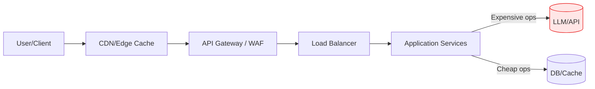

> This post introduces a series about **Denial of Wallet** (DoW) as a distinct failure mode from Denial of Service (DoS). In the first part, we'll explore how to reason about cost-aware rate limiting across CDN, gateway, and application layers. After that, you'll learn when to invest in custom limits, the second part will focus on user-aware limits and how to frame cost units and design strategies. Finally, part 3 of this series will provide a hands-on implementation.

## Introduction — The Cost Trap in AI-Era Systems

Six months after launching your AI-powered search feature, you get an urgent Slack message from finance: cloud costs have tripled. The operations team is confused. Your requests per second (RPS) metrics are steady. Latency is fine. No alerts fired. Everything looks healthy - except the bill.

The problem? Your uniform rate limits protect performance but ignore cost variance. A basic search query costs you fractions of a cent in Elasticsearch time. An [agentic conversation](#agentic-conversation-note) with GPT-4o and multiple tool calls costs $0.20-$0.50. Both count as "one request" under your standard per-user 100 req/min limit. A single user can stay well within rate limits while running up hundreds of dollars in LLM charges.

Traditional rate limiting was built for a simpler era when most requests had similar resource costs. In today's cloud-native systems (especially those integrating LLMs, vector databases, image generation, and third-party APIs) request costs vary by orders of magnitude (different number of tokens for LLM, different data shapes for database queries). Standard RPS-based throttles protect your infrastructure but leave your budget exposed.

This post introduces **Denial of Wallet** (DoW) as a distinct failure mode from Denial of Service (DoS). We'll explore how to reason about cost-aware rate limiting across CDN, gateway, and application layers. You'll learn when to invest in custom, user-aware limits and how to frame cost units and design strategies.

### Why Now? AI/LLM Adoption and Usage-Based Pricing

This problem has always existed with heterogeneous workloads - think image processing versus simple GETs. But LLM adoption has made it urgent. OpenAI charges $1.25 per million input [tokens](#llm-tokens-note) and $10.00 per million output tokens for GPT-4o. A single agentic workflow can easily consume 100,000 tokens, costing $0.20–$0.50 per request. Compare that to an Elasticsearch query at effectively near-zero cost per search after amortizing your cluster costs.

The cost variance is staggering. In systems where cheap and expensive operations share the same rate limit buckets, a user can unknowingly (or deliberately) shift their request mix toward expensive operations. Your performance stays fine. Your spend explodes.

To understand how to protect against this threat, we need to clearly distinguish between traditional performance-based attacks and cost-based exploitation. The key insight is that your existing DoS defenses (designed to protect availability and latency) operate on different metrics than what's needed to protect your budget. Let's examine how these two failure modes differ and why conventional rate limiting leaves you exposed to cost-based abuse.

Consider a typical scenario. You deploy a chatbot that can answer questions from cached knowledge (cheap) or invoke an LLM agent with web search capabilities (expensive). Your API gateway enforces 100 req/min per user. Everything works as designed.

Then a power user discovers they can run complex agentic queries repeatedly. They stay under 100 req/min. Your servers handle the load. But each query costs $0.40 in LLM fees. Over a month, this single user generates a $1,200 bill. Your rate limits did their job protecting availability. They just couldn't see the cost dimension.

## Denial of Service vs Denial of Wallet

Denial of Service attacks aim to exhaust system resources (CPU, memory, network bandwidth) making the service unavailable to legitimate users. Your CDN, WAF, and application rate limits are designed for this threat model. They cap requests per second, enforce queue depths, and shed load when close to saturation.

Denial of Wallet attacks exploit a different vulnerability: the cost dimension. An attacker (or even a legitimate but cost-oblivious user) stays within your performance-oriented rate limits but selectively triggers expensive operations. Your infrastructure remains healthy. Your bill skyrockets.

### Where DoS Controls Stop and DoW Begins

Traditional DoS defenses operate at the infrastructure layer. Your CDN throttles suspicious IPs. Your API gateway enforces global or per-API-key RPS caps. Your load balancer monitors backend health. These controls protect availability and latency. They work beautifully when all requests cost roughly the same.

But consider this scenario: your system serves both cached data lookups and live LLM inference. The cached lookup hits Redis and returns in 5ms at negligible cost. The LLM call waits 800ms for GPT-4o and costs $0.30. From a DoS perspective, the LLM call is slower but manageable — it's just one request in your queue. From a DoW perspective, it's 3,000x more expensive than the cache hit.

Your CDN and gateway can't see this cost difference. They count requests and bytes. They don't know which code path each request will take or which third-party APIs you'll invoke. Cost context lives in your application layer — in the business logic that decides whether to serve from cache, hit the database, or call an LLM.

### Cost Surfaces: LLM Calls, Vector Search, Data Egress, Image Processing

Modern cloud-native systems expose multiple cost surfaces. Here are common examples where request costs vary dramatically:

- **LLM API calls**: GPT-4o at $0.20–$0.50 per agentic conversation versus cached responses at $0.0001.
- **Vector search**: Embedding generation ($0.0001 per query with a small model) versus brute-force similarity across millions of vectors (seconds of GPU time).
- **Image processing**: Thumbnail generation (milliseconds, cents) versus AI upscaling or video transcoding (minutes, dollars).
- **Data egress**: Serving a 10KB JSON response versus streaming a 500MB dataset across regions.

Each of these can coexist in a single API surface. A user might invoke `/api/search` with a query parameter that triggers either a cheap cache hit or an expensive LLM fallback. The endpoint looks the same. The cost is not.

### Comparison: DoS vs DoW

| Dimension          | Denial of Service (DoS)                | Denial of Wallet (DoW)                            |
|--------------------|----------------------------------------|---------------------------------------------------|
| Primary goal       | Protect availability/latency           | Protect cost budget/spend risk                    |
| Trigger pattern    | High RPS, resource exhaustion          | Normal RPS, high-cost request mix                 |
| Detection signals  | 5xx, p95 latency, CPU saturation       | Bill/usage spike, per-user spend anomalies        |
| Controls           | CDN/WAF throttles, queue backpressure  | Cost-aware per-user/session quotas, budgets       |
| Risk owner         | SRE/Platform                           | Architecture/Product/Finance jointly              |

The key insight: **DoS protection is necessary but insufficient**. You need both performance-based and cost-based controls. DoW can occur even when all your DoS defenses pass. A single user running expensive workflows can dominate your monthly spend without ever triggering a 429 Too Many Requests response.

### Real-World DoW Scenarios

To make this concrete, let's examine two scenarios that illustrate how DoW manifests in production systems.

**Scenario 1: The Curious Power User**

Sarah, a legitimate user on your free tier, discovers your AI-powered document analysis feature. She uploads PDFs that trigger GPT-4o summarization. Here's how it unfolds:

1. **Day 1**: Sarah makes 50 requests/hour (well within your 100 req/hour limit)
   - Each request processes 20,000 tokens = $0.25 per request
   - Hourly cost: $12.50/hour
   - Daily cost: $300/day

2. **Your DoS monitoring dashboard**: All green
   - RPS: 0.83 req/sec (far below limits)
   - Latency: p95 = 2.1s (acceptable)
   - Error rate: 0%
   - CPU/memory: Normal
   - No alerts fire

3. **Your DoW reality**: One user costs $300/day = $9,000/month
   - Free tier budget allocation: $10/user/month
   - Actual loss: $8,990/month on this single user
   - If 100 users discover this pattern: $900,000/month burn

**Scenario 2: The Malicious Actor**

An attacker reverse-engineers your `/api/search` endpoint and discovers two code paths:
- Cache hit: Instant response, negligible cost
- LLM semantic search fallback: 800ms latency, $0.30 cost

The attack pattern:
1. Craft queries designed to miss cache (unique nonsensical phrases, random strings)
2. Stay at 90% of your rate limit (90 req/min from your 100 req/min limit)
3. Force expensive LLM fallback on every single request
4. Run continuously from multiple API keys to stay under per-key limits

**Cost impact breakdown:**
- Per API key: 90 requests/min × $0.30 = $27/minute = $1,620/hour
- Daily cost per key: $38,880/day
- With just 10 API keys: $388,800/day
- Traditional rate limiter verdict: "Everything normal, users at 90% of allowed RPS"
- Your monthly bill: Catastrophic

**How cost-aware rate limiting would prevent both scenarios:**

In both cases, a cost-aware rate limiter would have:

1. **Pre-execution check**: Before invoking the costly LLM, estimate the request cost based on workflow type or any other heuristics
2. **Budget check**: Query the user's budget (more on this in the next part) to see how much spend remains
3. **Enforcement decision**: Decide to allow or reject based on remaining budget, not just RPS
4. **Graceful rejection**: Return `429 Too Many Requests` with headers:
   ```
   X-RateLimit-Cost-Remaining: 0
   X-RateLimit-Cost-Reset: 1637012400
   Retry-After: 3600
   ```
5. **Cost attribution**: Record actual cost post-execution for observability and billing

Sarah would have received clear feedback after hitting her $10/month limit, prompting an upgrade conversation. The attacker would have been throttled after exhausting their allocated budget, regardless of staying under RPS limits.

## Anatomy of Enterprise Rate Limiting

Understanding where cost-aware limits fit requires mapping the typical layers of enterprise traffic management. Each layer sees different information and enforces different policies. Cost context becomes visible only at specific points in the stack.

### CDN and WAF Strengths and Blind Spots

Your CDN and Web Application Firewall sit at the edge. They see raw HTTP requests from IP addresses. They're excellent at detecting volumetric attacks, geographic anomalies, and malicious patterns. They enforce coarse-grained limits:

- Requests per second per IP or region
- Request size limits
- Path-based throttling (e.g., 10 req/s for `/api/*`)

What they don't see:
- **User identity**: Which authenticated user is making the request
- **Session or user/tenant context**: Whether this is a free trial or enterprise account
- **Cost implications**: Which backend services will be invoked
- **Business logic**: Whether the request will hit cache or trigger expensive operations

CDN and WAF limits protect your infrastructure from brute-force abuse. They're your first line of defense against traditional DoS. But they operate on metadata—headers, paths, source IPs—not on the semantic meaning or cost of each request.

Most CDNs and WAFs cannot natively enforce cost-aware limits. In practice, most teams implement cost-aware limiting at the application layer (or integrate it into their service mesh) where cost context is naturally available, and use CDN/WAF for traditional DoS protection.

### Application Layer: Tying Requests to Users, Sessions, Tenants, Plans

Cost-aware rate limiting happens in your application layer. This is where you have:

- **Authentication context**: User ID, API key, OAuth token
- **Authorization context**: Product plan, subscription tier, feature flags
- **Business logic visibility**: Which code paths will execute, which external services will be called
- **Cost attribution**: The ability to estimate or measure per-request costs

At this layer, you can answer questions like:
- "How much has this user spent in the last hour?"
- "Is this tenant approaching their monthly budget?"
- "Should we serve from cache or allow an LLM call?"

This is where you implement custom rate limiting (e.g. using a distributed cache like Redis or in-memory state stores). You track cost-weighted tokens per user, per session, or per tenant. You enforce per-plan quotas. You integrate with observability to detect spend anomalies.



### Observability: Metrics You Need Before Building Cost-Aware Limits

Before implementing custom rate limiting, instrument your application to collect baseline cost data:

1. **Per-request cost metrics**: Tag each request with estimated or actual cost. Export to Prometheus, Datadog, or CloudWatch.
2. **Per-user/tenant aggregations**: Sum costs over rolling time windows (1m, 5m, 1h, 1d).
3. **Cost distribution**: Track p50, p95, p99 costs per endpoint or workflow to understand variance.
4. **Request mix tracking**: Log which code paths executed (cache hit vs LLM call) to identify high-cost patterns.
5. **Agentic workflow tracing**: For complex multi-step operations, trace the full call graph to attribute costs accurately (some useful tooling exists already for this, e.g. LangFuse).

Without these metrics, you're flying blind. You won't know which users are driving costs, which operations are expensive, or where to set budget thresholds. Start with observability, then build controls.

Having said that, if you are working on a greenfield project with LLM integration and you don't yet have cost data, it's reasonable to start with educated estimates based on how much your business is willing to spend per user/session/tenant. You can refine your limits as real data comes in.

## Cost Awareness in System Design

Designing cost-aware systems starts with modeling heterogeneous request costs. Not all operations are created equal. Even within a single endpoint, different execution paths can have wildly different price tags.

### Modeling Costs per Workflow vs per Endpoint

Traditional rate limiting thinks in terms of endpoints: `/api/search` gets 100 req/min, `/api/upload` gets 10 req/min. Cost-aware rate limiting thinks in terms of workflows and resource consumption. The currency here isn’t time: LLM cost is driven by tokens (requests × tokens in/out), not latency.

Consider a search endpoint that can:
- Serve from an in-memory cache (cost: $0.0001)
- Query Elasticsearch (cost: $0.001)
- Fall back to an LLM for semantic understanding (cost: $0.20)

The endpoint is the same. The workflow cost varies by 2,000x. A user could make 100 requests per minute, all hitting the LLM fallback, and stay within your RPS limit while burning through $20/minute or $1,200/hour.

To model this, define **cost units** for each workflow:

```javascript
// Map operation -> cost units (normalized to $ or credits)
const COST_TABLE = {
  'search.basic': 0.0001,
  'search.es': 0.001,
  'search.llm': 0.2
};

function estimateCost(operation, params) {
  // Optionally scale by tokens, size, or retries
  const base = COST_TABLE[operation] ?? 0;
  const multiplier = params?.tokens ? params.tokens / 1000 : 1;
  return base * multiplier;
}
```

This simple table lets you attach a cost estimate to every request. You can refine it over time based on real billing data. The key is making cost a first-class metric alongside latency and error rate. We will cover this in more detail in following parts of this series.

### Measuring and Attributing Cost to Users/Sessions/Tenants

Cost-aware rate limiting requires attributing costs to specific actors. You need counters keyed by:

- **User ID**: Track individual user spend
- **Session ID**: Limit costs per browsing session (useful for anonymous users)
- **Tenant ID**: Enforce per-organization budgets in B2B SaaS
- **Product plan**: Apply different budgets for free, pro, and enterprise tiers

Ensure these limits are clearly disclosed to customers in SLA and other customer-facing documents.

Example cost attribution flow:
1. Request arrives with authentication token
2. Extract user ID and product plan
3. Estimate request cost from workflow type
4. Check if user's current spend + estimated cost <= budget
5. Allow or deny request
6. Record actual cost post-execution for observability

This requires fast lookups. Redis is a common choice for storing per-user cost counters with TTLs matching your time windows (e.g., 1-hour sliding windows). We will cover implementation details in part 2 of this series.

## When to Invest in Custom Rate Limiting

Not every system needs cost-aware rate limiting. Building and maintaining custom logic adds complexity. You need to balance the cost of implementation against the risk of budget exposure. Here are clear indicators for when to invest.

### Decision Checklist (Must-Have Signals)

Invest in custom cost-aware rate limiting if you see these patterns:

1. **Material cost variance (≥10–100x) across request types**
   - Quantified threshold: p99 cost / p50 cost > 100x
   - Example: LLM calls ($0.30) vs cache hits ($0.0001) = 3,000x variance
   - If your cheapest and most expensive operations differ by 100x or more, uniform rate limits can't protect you.

2. **Unpredictable or spiky workloads**
   - Quantified threshold: Top 5% of users drive >50% of total spend, or week-over-week cost variance >30%
   - Example: Power users discovering expensive workflows or seasonal usage spikes (look at current - Q4 2025 - Antropic Claude Code weekly limits ;) )

3. **Clear budget constraints (per week/month or per tenant/plan)**
   - Quantified threshold: Hard monthly budget cap exists, or per-tenant contractual limits are in place
   - Example: Free tier limited to $10/month per user
   - Finance cares about the bill, not the RPS.

## Wrapping Up Part 1

This post introduces *Denial of Wallet (DoW)* as a failure mode distinct from traditional *Denial of Service (DoS)*. While DoS attacks overwhelm system performance, DoW exploits cost differences in modern applications (especially those involving LLMs, vector search, and image processing) where some requests are orders of magnitude times more expensive than others. Uniform rate limits based on requests-per-second no longer protect budgets, because even low-volume users can trigger costly operations without breaching performance limits.

---

### Agentic conversation note
For simplicity, assume that agentic conversation is a workflow where we have a "coordinator" LLM that supervises the API request execution, calls other LLMs/tools as needed, and aggregates results. This is more expensive than a single LLM call due to multiple invocations and orchestration overhead.

### LLM tokens note
For the sake of this post, think of tokens as unit of data that LLMs process. E.g. imagine API that processes text and provides a summary. Then "input tokens" is the size (e.g. number of words/characters) of the text you send to API, and "output tokens" is the size of the summary you get back. LLM pricing is often based on number of input and output tokens processed. In practice, it is hard to estimate exact token counts before making the API call (especially output tokens - but some LLM APIs let you set a maximum).