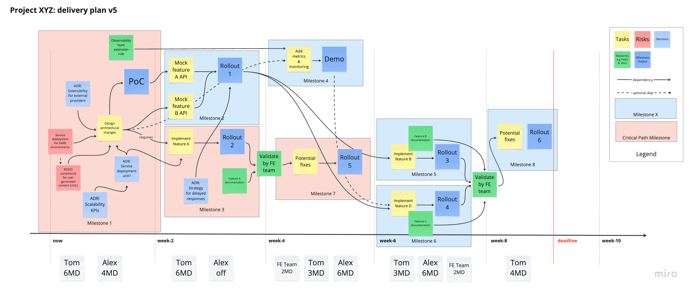

# Effective planning for Site Reliability Engineering (SRE)

Site Reliability Engineering (SRE) is a discipline that blends software engineering with operations, aiming to build and maintain scalable and reliable systems. SRE teams often operate under constant pressure from production incidents, evolving technology, and organizational priorities. That’s why having a solid, flexible, and thoughtful planning approach is essential to ensure the success of both long-term projects and day-to-day operations.

In this blog post, we share our approach to planning SRE projects, tasks, and initiatives. We focus on practical principles and proven techniques that help teams balance project execution with ongoing operational responsibilities, enabling them to deliver reliable, high-quality outcomes even in fast-paced and dynamic environments.

## Context: the nature of SRE work

The scope of SRE work spans several areas, which can be broadly categorized into the following:

- **Project tasks**, such as migrating to a new technology or platform, implementing new features like rate-limiting, improving system performance, reducing infrastructure costs, or increasing service reliability.
- **Operational tasks**, including handling incidents, writing postmortems, maintaining runbooks, participating in on-call rotations, and setting up and managing monitoring.
- **Cyclical tasks**, such as reviewing Service Level Objectives (SLOs) and Service Level Indicators (SLIs), preparing availability and performance reports, and conducting regular audits or reviews.

Multiple SRE projects and tasks often run in parallel, with different priorities, varying levels of urgency, and shared resources. This complexity makes planning and prioritization particularly challenging. Additionally, SRE work is frequently interrupted by unexpected incidents or outages, which can derail planned work and disrupt timelines. To make matters more complex, many tasks and projects are interdependent and require cross-team coordination and collaboration, making communication and visibility critical components of success.

## Why effective planning is crucial

A thoughtful planning process is the foundation for effective SRE work. It allows teams to prioritize and manage their workload in a way that is both realistic and sustainable. Good planning ensures that technical goals are aligned with business priorities and stakeholder expectations, while also accounting for the team's operational responsibilities and potential interruptions.

Without proper planning, SRE teams may fall into cycles of constant firefighting, burnout, or lack of progress on strategic initiatives. Planning helps bring structure and clarity to the chaos, enabling the team to identify risks, allocate resources wisely, and communicate status and direction effectively.

Planning in SRE should not be rigid or bureaucratic. Instead, it should be lightweight, collaborative, and iterative, focusing on key aspects such as solution design, implementation, release, documentation, and monitoring - while remaining adaptable to change.

## Best practices for planning SRE projects and tasks

Below are the key principles and practices we follow when planning SRE work. These are not rigid steps, but rather guiding patterns that we adjust based on the nature and complexity of the task or project at hand.

### Start by defining clear objectives

Before any planning activity begins, it's critical to define the objectives of the project or task. This includes identifying the desired outcomes, success criteria, and key performance indicators (KPIs) that will be used to measure progress and results.

For example, an SRE project might aim to improve service reliability by reducing the number of incidents and outages by 50% over the next quarter, using metrics like mean time to recovery (MTTR) and mean time between failures (MTBF). Another objective might be to reduce the time required to roll out high-risk changes - such as operating system patches, Docker image updates, or a Java version migration - by streamlining the deployment process and redefining the rollout strategy.

Clear objectives create alignment among team members and stakeholders, and serve as a north star when prioritizing work and making trade-offs.

### Use lightweight tooling to visualize the plan

Planning doesn't require heavyweight tools or complex processes. In many cases, the best results come from simple, visual approaches that help teams collaborate and stay aligned. This might include physical whiteboards and sticky notes, or digital tools such as Miro, Mural, or shared spreadsheets.

The main goal is to visualize the project as a series of interconnected tasks over time. This makes it easier to identify risks, dependencies, decision points, and resource requirements. A visual plan encourages discussion, feedback, and iterative improvements throughout the lifecycle of the project.

### Embrace the shift-left approach

One of the most effective planning techniques in SRE work is to adopt a shift-left mindset. This means addressing risks, dependencies, decisions, and technical uncertainties as early as possible in the planning process, rather than waiting until they become blockers later in the project.

For example, moving rate-limiting logic from an application cotainer to a sidecar proxy service may require architectural decisions, design reviews, and cost justifications. Addressing these questions at the beginning of the project ensures that the right people are involved, and that there's enough time allocated for approvals, discussions, and iteration.

Where appropriate, teams can use Requests for Comments (RFCs), Architecture Decision Records (ADRs), or similar documentation formats to capture context, outline options, and document the reasoning behind key decisions.

### Break down the work into milestones

Rather than trying to plan an entire project in one go, it's more effective to break it down into smaller, manageable chunks - each with a clear milestone and deliverables. These milestones help track progress, provide natural feedback loops, and create opportunities to validate assumptions along the way.

Each milestone can focus on a specific area such as design and architecture, implementation and testing, rollout and release, or monitoring and troubleshooting. However, it’s important to address all these areas from the start and to iterate over them continuously, rather than treating them as linear or isolated phases.

For example, a project milestone might involve completing the rollout of an internal CLI tool used by SREs, followed by a demo and collection of feedback. The next milestone could involve improving the monitoring setup or optimizing performance based on feedback and real-world usage.

### Identify and focus on the critical path

The critical path refers to the sequence of tasks that determines the minimum amount of time required to complete the project. Identifying this path allows the team to focus on high-impact tasks, allocate resources strategically, and make decisions that directly influence project success.

For example, in a platform migration project, the critical path might involve migrating only the most heavily used SRE commands first, while deferring less critical ones to later milestones. This approach allows teams to deliver value early, reduce risk, and avoid bottlenecks.

### Estimate work and verify team capacity

To create a realistic plan, it's important to estimate the size and complexity of individual tasks. This can be done using simple methods like t-shirt sizing (S, M, L, XL), man-day estimates (1, 2, 3, 5, 8, 13 days), or story points - depending on what the team is comfortable with.

Once estimates are in place, the next step is to verify the team’s capacity. This includes accounting for holidays, planned leave, ongoing operational responsibilities (like on-call rotations or incident response), and other project commitments. Each team member should declare their expected availability, and if the total capacity falls short of what's needed, then the plan should be adjusted accordingly - by reducing scope, extending the timeline, or increasing team size.

### Communicate the plan and iterate often

Once the plan is drafted, it's important to communicate it clearly and transparently with all stakeholders. This includes sharing the objectives, timelines, milestones, risks, dependencies, and assumptions. Visual plans should include legends, clear labels, and dependency arrows to make them easy to interpret. The more visual and accessible the plan is, the easier it will be for everyone to understand and engage with it - e.g you can use four-quadrant influence/interest matrix to identify key stakeholders and their level of involvement (stakeholder mapping).

Most importantly, remember that the plan is a living document. It should be reviewed and updated regularly as the project evolves, new information becomes available, or team capacity changes. A good plan encourages collaboration, facilitates alignment, and supports continuous improvement.

## A step-by-step example: visual planning in action

To make the planning process more tangible, let's walk through a practical example using a visual approach. We recommend using a digital whiteboard tool like Miro or Mural, which allows teams to collaborate asynchronously and create a shared visual plan. Below, we outline a six-step planning method with concrete tips, inspired by real-world SRE projects.

### Step 1: visualize the project timeline

Start by creating a visual board to lay out the project's timeline and task structure.

- Use a vertical axis to represent **time** - this could be weeks, months, or quarters. Mark important dates, such as deadlines, releases, holidays, or other constraints that affect team availability.
- Use a horizontal axis to list **tasks**. Represent each task with a sticky note that includes:
  - A **short, descriptive title** (e.g., “Add SLO dashboards”)
  - A **color code** to distinguish task types:
    - 🔴 Red for risks
    - 🟡 Yellow for planned tasks
    - 🟢 Green for resources or capacity
    - 🔵 Blue for decisions
  - Keep sticky notes **small** to reduce visual clutter and force concise descriptions.
- Draw arrows to indicate **task dependencies**:
  - Solid arrows for confirmed dependencies
  - Dotted arrows for uncertain ones
  - Ensure arrows are unidirectional and avoid loops
- Add a **legend** to the board to explain color codes, arrow styles, note sizes, and any other symbols used.

This setup helps the team grasp the big picture and start discussions around sequencing and priorities.

### Step 2: apply the shift-left mindset

Bring uncertainty, risk, and decision-making to the front of the planning process.

- Identify what’s **known vs unknown**, and mark the unknowns clearly on the board.
- Highlight **risks** with red sticky notes, and specify which teams or systems they affect.
- Shift all risks and major decisions to the **earliest possible point** on the timeline, so they don’t block downstream tasks.
- Estimate the **time and effort needed for decisions**, and add them as tasks - don’t assume decisions “just happen.”
- For complex decisions, plan to write **RFCs or ADRs** early. Use them to explore options and involve stakeholders.
- If documentation will be required (design docs, runbooks, training material, etc.), add a task and allocate time for it early in the plan.

This approach surfaces problems early, reduces surprises, and enables smoother delivery.

### Step 3: break work into milestones and plan rollouts

Group tasks into meaningful milestones with clear deliverables.

- Define each **milestone** by its outcomes - this could be a feature rollout, an internal demo, or a proof of concept.
- If a milestone ends with a **production rollout**, plan extra buffer for coordination and risk mitigation.
- Choose between **time-boxed** (e.g., 2 weeks) or **feature-boxed** (e.g., complete rate-limiting feature) milestones depending on complexity.
- For projects involving multiple teams, use milestones to align on **contracts** or deliver **mocked APIs** to unblock dependent work.
- Use **feature flags** or **shadow mode** deployments to gather feedback early without exposing risk to users.

This ensures that each milestone delivers value and provides a feedback loop before moving forward.

### Step 4: identify the critical path

Determine the essential sequence of tasks that governs project duration.

- Mark the **critical path** on the visual board using a different color or style (e.g., mark relevant milestones in red background).
- Any risks, decisions, or dependencies on this path should receive high attention and priority.
- Try to identify the critical path early so the team can optimize for speed and reduce delays.
- That said, if the critical path is too risky or expensive, teams might **intentionally defer** parts of it - for instance, migrating only a subset of critical CLI commands first.

This step helps the team focus energy where it matters most, and creates clarity for prioritization.

### Step 5: timebox tasks and check capacity

Ensure that planned work is realistic based on available team bandwidth.

- Use **tags or labels** to estimate task size or complexity (e.g., S/M/L or 2, 3, 5 days).
- Ask each team member to **declare availability** per week, excluding holidays, on-call time, and other commitments.
- Update availability regularly to reflect changes (e.g., new projects, vacations).
- If the plan doesn’t fit the available capacity, adjust by **scoping down**, **shifting timelines**, or **adding contributors**.

This practice protects the team from burnout and ensures that commitments are feasible.

### Step 6: materialize and execute the first milestone

Once planning is complete, it’s time to operationalize the work.

- Translate the first milestone into actionable tasks on your team’s sprint board (e.g., Jira, Trello).
- Link sticky notes on the whiteboard to tickets in the backlog to maintain traceability.
- Monitor milestone progress closely, and update the plan as the situation evolves.
- Share status updates with stakeholders frequently, and be transparent about changes in scope, risk, or timelines.

By grounding your planning in both a visual workspace and a sprint tool, you maintain alignment between vision and execution.

## Conclusion

Planning in the context of Site Reliability Engineering is not about creating perfect schedules - it’s about building a shared understanding of goals, constraints, and strategies. It enables teams to stay focused and effective, even in the presence of uncertainty and operational disruptions.

By using lightweight planning tools, applying shift-left practices, breaking work into milestones, identifying the critical path, and verifying capacity, SRE teams can stay resilient and adaptive. Most importantly, good planning makes work visible, promotes healthy team dynamics, and increases the chances of delivering reliable, scalable, and valuable outcomes.

If your team is struggling to balance operations and engineering work, or if your projects frequently get derailed by unexpected events, it might be time to revisit your planning practices - and hopefully, the ideas shared here will serve as a helpful starting point.
