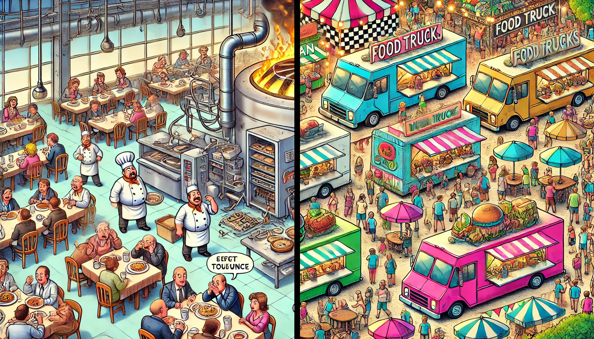

Recently, our team embarked on a major architectural transformation - moving from a monolith to a services-based architecture. As expected, the engineers on our team understood the rationale behind this shift, but the business stakeholders had concerns.

They asked: *Why should we move away from a system we have already seen in action? What benefits do services bring beyond just technical improvements?*

We needed an analogy that would make the differences between monolithic and service architectures clear, relatable, and memorable. So, when we were asked to present our reasoning to leadership, we came up with something that clicked immediately: comparing a large restaurant to a food truck festival.

## Monolith vs. services: testaurant vs. food trucks

Think of two contrasting dining experiences. In one, you have a single large, busy restaurant with one centralized kitchen—this represents monolithic architecture. The restaurant is responsible for preparing everything: burgers, vegan dishes, desserts, and more. All the chefs share the same kitchen space, use the same equipment, and rely on a single team to serve all customers. At first glance, this setup seems efficient because everything operates under one roof. However, let’s dive deeper.

Now, imagine a large food festival with potentially thousands of customers—this represents service architecture. Each food truck in the festival is an independent service. Every truck specializes in a specific type of food: one serves burgers, another serves vegan dishes, and a third specializes in desserts. Each truck is self-contained, with its own staff, ingredients, and equipment.

Now, let’s break it down into specific areas of comparison.

## Specialization and autonomy

Monolithic architecture (large restaurant): A single, large restaurant has one centralized kitchen where all food is prepared. If the kitchen becomes overwhelmed or disorganized, the entire operation slows down. The burger chef might have to wait for the dessert chef to finish using the stove, and the vegan chef might struggle to avoid cross-contamination. There’s little room for specialization because everyone depends on the same resources.

Service architecture (food trucks): Each food truck focuses on its specialty without relying on others (often they even don’t know about each other). This independence allows them to work faster and better, with no conflicts over shared staff, ingredients, or equipment.

## Scalability

Monolithic architecture (large restaurant): When more customers arrive, the only way to handle increased demand is to expand the kitchen, hire more chefs, and cram more equipment into the same space. Scaling becomes expensive, disruptive, and inefficient as the kitchen becomes overcrowded (which may result with poor customer experience like cold dishes).

Service architecture (food trucks): If the festival grows, new trucks can join - just like new teams or services in software. This allows for more variety and the ability to serve more customers without disrupting existing operations.

## Fault tolerance

Monolithic architecture (large restaurant): If one part of the kitchen fails - say, the stove breaks down or a chef calls in sick - the entire restaurant slows down or even stops. A single issue can ripple through the entire operation.

Service architecture (food trucks): If one truck faces issues (runs out of supplies or has a technical failure), the others continue serving customers. One truck going down doesn’t shut down the whole festival.

## Coordination without overlap

Monolithic architecture (large restaurant): Because the kitchen operates as a single unit, adding a new dish (or a feature/technology in software) requires retraining all chefs, redesigning workflows, and potentially remodeling the kitchen. Miscommunication between staff can lead to delays or mistakes that impact the entire customer experience.

Service architecture (food trucks): While each truck operates independently, there’s still a festival coordinator (like a shared infrastructure team) ensuring there’s enough power, parking, and crowd management. However, each truck controls its own menu, and most changes do not require coordination with others.

## Growth and flexibility

Monolithic architecture (large restaurant): Transitioning to a new cuisine or scaling up to meet growing restaurant popularity is difficult. Remodeling the kitchen, retraining staff, and introducing new workflows is time-consuming and costly. The rigid structure makes it hard to adapt to changing customer preferences or introduce new offerings.

Service architecture (food trucks): Trucks can be easily swapped, removed, or added based on customer demand. If a new food trend emerges, a new truck can join without affecting the existing ones. It’s much easier to bring in a new truck than to remodel an entire restaurant kitchen.

## Resource usage efficiency

Monolithic architecture (large restaurant): The kitchen must handle all kinds of orders simultaneously, whether it’s burgers, vegan dishes, or desserts. If a large catering order comes in for desserts (akin to batch processing a large dataset in software), the kitchen must dedicate significant resources to it, slowing down service for regular diners. Customers of the restaurant have to wait until the catering order is completed.

Service architecture (food trucks): If there’s a long line at the burger truck, another identical truck can be brought in to handle the load. Other trucks (e.g., vegan or dessert) remain unaffected. If there’s a large catering order for desserts, a specialized dessert truck can park in a separate area, focus on fulfilling the batch, and leave when done - without disrupting the rest of the festival.

## Summary

A well-known proverb says, *"Too many cooks spoil the broth.”* This perfectly describes the challenges of large teams working within a monolithic architecture.

Summarizing the benefits of moving to a services architecture:
- Team autonomy: By switching to a services architecture (or the food truck approach), teams gain greater autonomy, much like how food truck staff can focus on their own recipes without interference.
- Better and more granular scalability: Just like adding more food trucks can handle high demand without disrupting existing operations, services architecture allows for seamless system scaling.
- Fault tolerance: If one service (or food truck) fails, others continue running, reducing overall downtime.
- Limited coordination overlap: Each team (or truck) manages its operations independently, requiring minimal coordination.
- Flexibility: Services architecture enables quick feature introduction or strategy shifts, just like a food truck can easily switch cuisines.
- Efficient resource usage: Services architecture optimizes resource allocation, much like adding individual food trucks based on demand rather than overloading a single restaurant kitchen.

## Final Thought

This analogy was meant to provide a straightforward explanation without getting lost in countless corner cases (of which we have more than a dozen for each section). While we acknowledge that both monolithic and service architectures have their strengths and weaknesses, two key factors particularly favored the services approach in our case: multiple teams developing the project independently and the unknown scale of the project.

A restaurant is often associated with quality, luxury, and a certain standard - just like a monolith, where the rules are the same for all teams, providing consistency. However, this centralized approach requires strong management and coordination, replacing autonomy with strict rules, monitoring, and validation. For example, a single tomato supplier affects all chefs - if there’s a problem with the delivery, the entire restaurant is impacted. Managing such dependencies and coordinating changes can become a significant operational cost.

On the other hand, a food festival thrives on scale and rapid product development by multiple independent teams, much like a services architecture. It allows for innovation, faster adaptation to trends, and greater resilience. However, it also requires more monitoring to ensure quality and remove underperforming food trucks.

A restaurant may not work at a festival, but in a controlled environment with a predictable number of customers, it offers distinct benefits. The real question is - can we still predict customer demand in an era driven by social media and constant change?
