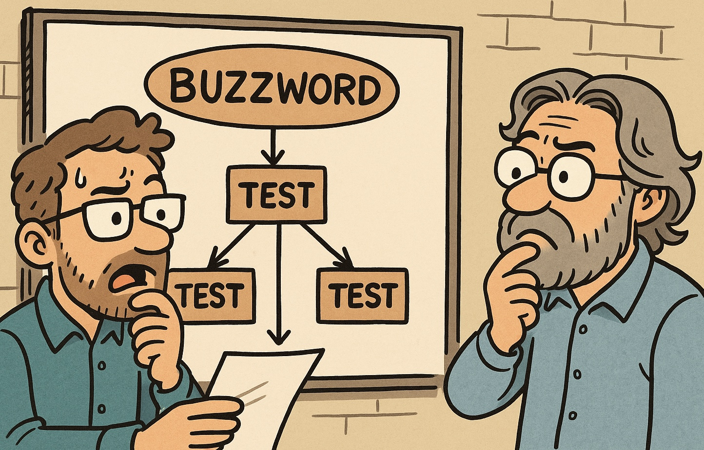

In software development, naming is often harder than writing the code itself. We've all been there... Struggling to find a name that is clear, accurate and expressive enough to capture what a technique or pattern actually does.

Today we're going to roast naming conventions that use the word "test" in ways that can be misleading. It's a common shortcut that can lead to confusion about the true purpose of a technique.

It happens more often than you'd think and often, the resulting names are a bit misleading. Let's look at two well-known examples.

## Test-Driven Development

Test-Driven Development (TDD) sounds like a testing methodology, but its purpose goes much deeper.

While tests are certainly written, the practice is more about incremental design. Writing a failing test first helps clarify intent, drive better structure, and guide implementation. The test is not the goal — it's the mechanism for designing code in small, verifiable steps.

In practice, TDD helps developers:

* Think about edge cases early
* Write modular and testable code
* Keep implementation minimal and focused

So despite the name, TDD isn't centered on testing — it's about designing with feedback.

## Contract Testing

Another good example is Contract Testing, particularly in the context of Consumer-Driven Contracts (CDC).

The name suggests that we're testing a contract between two services — and yes, technically, we are. But the real power of CDC is in what it enables: communication between independently deployed teams.

When a consumer's expectations change, the contract test fails — which acts as a trigger. But that failure isn't the outcome — the conversation that follows is. It leads to negotiated, versioned, and safer evolution of APIs.

In short: CDC is less about "testing contracts" and more about managing change through collaboration.

## Final thought

So why does "test" keep showing up in places where the core idea isn't actually testing?

Likely because it gives the technique a sense of rigor. It suggests verification, structure, and confidence — all things teams care about.

And that's not necessarily a bad thing. But it's worth being aware of the distinction between what the name implies and what the technique actually delivers.