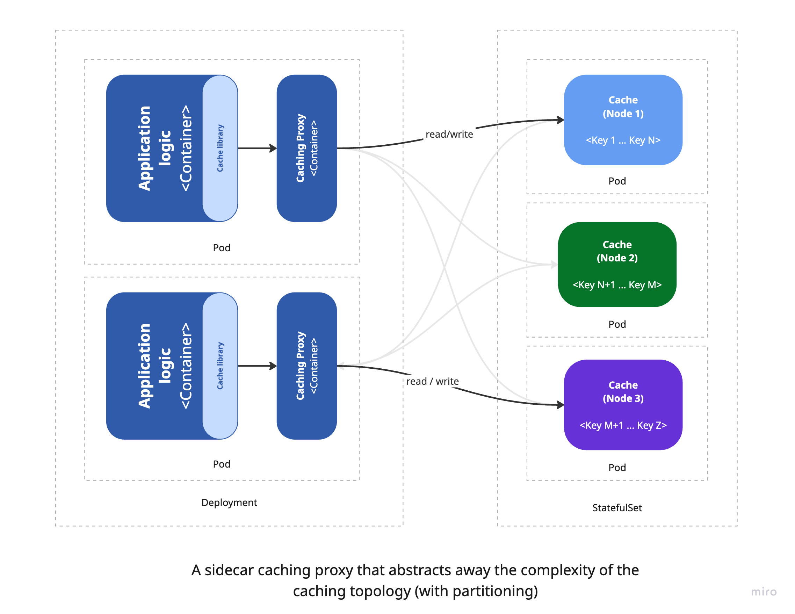
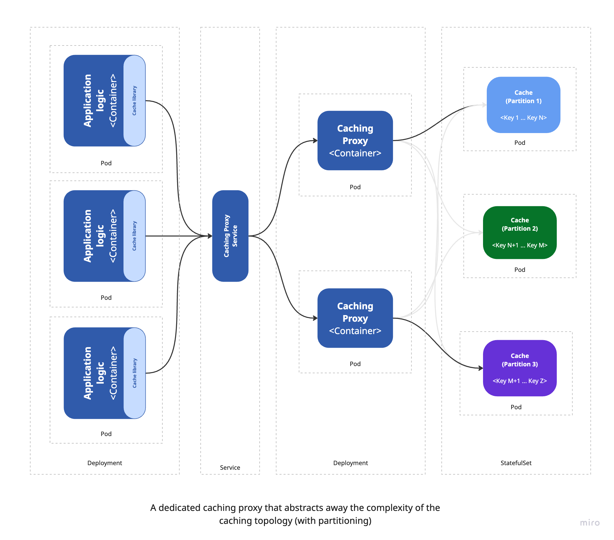

In the [previous article](https://handsonarchitects.com/blog/2025/partitioning-of-key-value-data-in-cache-systems/), we introduced cache partitioning and highlighted its advantages for scaling large applications. We also explained how separating partitioning logic from the application itself can be achieved by introducing a dedicated caching proxy layer that handles partitioning transparently. This layer can be deployed either as a sidecar container or a centralized dedicated caching proxy, depending on the system's scale and complexity. In this article, we’ll evaluate both approaches, outlining their strengths and limitations within the context of modern application architectures.

To set the stage, we’ll first explore how caching architectures have evolved—from basic client-side libraries to advanced caching layers that offer greater abstraction, scalability, and operational flexibility.

## Client libraries for starting point

Caching plays a vital role in modern application architectures by enabling faster data retrieval and enhancing overall performance. As applications grow in complexity, their caching requirements also evolve, giving rise to more advanced caching strategies.
In the early stages of development, caching is typically handled using client libraries that connect directly to systems like Memcached or Redis. These libraries offer a straightforward way to store and retrieve frequently accessed data, reducing latency and boosting read performance.

In distributed setups, this approach allows stateless services to share cached data across instances, improving both scalability and efficiency. Developers can choose from a wide range of client libraries tailored to specific technologies and languages - for example, [spymemcached](https://github.com/couchbase/spymemcached) for Memcached or [jedis](https://github.com/redis/jedis) for Redis.

The diagram below illustrates a simple application deployed with a few replicas, each connecting to a set of cache instances configured in a master-slave (also known as leader-replica) architecture. In this setup, the master (leader) node handles all write operations, while the replica nodes are used for read operations. Each application instance is typically configured with logic or client settings to direct writes to the leader and reads to the replicas.


In a Kubernetes environment, this basic architecture can be represented as follows:


For straightforward applications, using a lightweight caching library with a basic failover mechanism - such as a master-slave setup - can be an effective and practical choice. The application logic communicates with the cache directly, enabling developers to perform basic operations like `get`, `set`, and `delete` with minimal overhead - similar to working with in-memory structures such as dictionaries or hash maps. With just a few lines of code, it's possible to introduce caching that meaningfully boosts performance. For example, the following snippet shows how to store a key-value pair in Memcached using the `spymemcached` client library:

```java
List<InetSocketAddress> addresses = Arrays.asList(
    new InetSocketAddress("cache.instance1.url", 11211),
    ...
);
MemcachedClient client = new MemcachedClient(new HashSet<>(addresses));
client.set("key", 3600, "value");
```

The primary advantage of this approach lies in its simplicity - it allows developers to concentrate on application logic without needing to manage caching intricacies. However, as applications grow in size and complexity, several limitations begin to surface, posing risks to performance and scalability:

- **Tight coupling with cache implementation**: Application logic becomes closely tied to specific caching clients, making it difficult to scale or switch technologies. Most client libraries offer limited features, lacking support for advanced capabilities like consistent hashing or dynamic scaling. The situation worsens in polyglot environments where different services may require different client libraries, resulting in inconsistent behavior and increased maintenance overhead.
- **No abstraction layer**: Since the application interacts directly with the caching protocol and data structures, it's tightly bound to a specific cache backend. Migrating from one caching system (e.g., Memcached) to another (e.g., Redis) often requires significant refactoring.
- **Scalability limitations**: As the number of cache nodes grows, maintaining connections becomes more complex and resource-intensive. Each application instance must manage its own connections, which can lead to contention, increased memory usage, and higher latency - especially at scale. This relation is often referred to as the "N+1 connection problem," where N is the number of application instances and 1 is the number of cache nodes. As the number of application instances increases, the number of connections to the cache nodes grows linearly, leading to potential performance bottlenecks and increased resource consumption.
- **Rigid topology assumptions**: Applications are often designed with a fixed cache topology in mind, expecting a certain number of nodes at specific locations. Any change in the cache cluster - like adding or removing nodes - requires updates to the application, reducing flexibility.
- **Fault tolerance challenges**: Handling cache node failures and retries falls on the application, increasing logic complexity and the risk of inconsistent behavior. This can lead to increased latency and reduced performance, as the application must handle retries and fallbacks in case of cache node failures.

## Decoupling caching from application

As applications become more complex and scale across environments, the demand for advanced caching architectures becomes increasingly apparent. This evolution is driven by the need to accommodate dynamic cache topologies, offer a consistent interface for all applications, and shield developers from the intricacies of underlying caching technologies. From an architect’s viewpoint, the goal is to build a resilient and adaptable caching layer capable of responding to shifting workloads and system requirements. From a developer’s standpoint, it’s about reducing complexity by abstracting cache management, allowing the application to focus on its core business logic.

To address these challenges, a key step is to decouple caching responsibilities from the application logic by introducing an intermediate caching layer that abstracts the complexity of the underlying cache system. This layer - often implemented as a proxy - can run as a sidecar container alongside the application container, offering a transparent caching interface. With this setup, the application interacts with the cache as though it were a single, unified store, regardless of how data is partitioned or distributed across cache nodes. This pattern is commonly known as the ambassador pattern, where the sidecar acts as an intermediary that manages all communication with the cache cluster. It's a simple yet powerful way to retain compatibility with existing client libraries while gaining greater flexibility and scalability.



The diagram above demonstrates how sidecar containers integrate into the overall architecture. These containers are deployed within the same POD as the main application container, allowing them to share the network namespace and communicate over `localhost`. Typically, adopting this model requires minimal changes to the application itself, since existing caching client libraries can often be reused. The sidecar container takes responsibility for managing cache operations - such as partitioning, scaling, and fault tolerance - freeing the application to concentrate solely on its core functionality.

That said, while the sidecar pattern offers a cleaner separation of concerns compared to directly embedding cache logic in application code, it does have some drawbacks:

- **Connection management**: Because each sidecar container maintains its own connections to backend cache services, scaling out the application also increases the number of cache connections. This can overwhelm cache servers and degrade performance. Unlike centralized approaches, the sidecar pattern doesn’t easily allow multiplexing of multiple client requests through a shared connection pool.
- **Configuration complexity**: Introducing a sidecar involves additional configuration in the deployment setup. For instance, when using Memcached with Ketama consistent hashing, you must configure the sidecar with the appropriate hashing algorithm and backend cache node details. As the system scales, maintaining accurate configurations becomes more challenging and error-prone.
- **Operational overhead**: Since sidecars are co-located with application containers, they must be monitored and maintained as part of the overall system. This includes tracking their health, managing restarts, and ensuring they run correctly - adding to the system’s operational complexity.

Even with these challenges, the sidecar pattern represents a valuable step toward decoupling cache responsibilities from the main application. It’s a practical and scalable solution for most medium to large-scale systems. However, for larger systems with many application replicas, this architecture may become inefficient due to increased connection overhead and higher maintenance complexity.

## Dedicated caching proxy layer

For high-traffic, large-scale applications with complex caching needs, the sidecar pattern may fall short. In these scenarios, a dedicated caching proxy layer - managed independently of the application - is often a better fit. This layer acts as a centralized service that exposes a unified interface for accessing multiple cache instances, enabling more efficient use of resources, improved performance, and simplified management of cache clusters.

Such a service can optimize connection handling by multiplexing multiple client requests through a limited set of backend connections, reducing load on cache servers. It also supports advanced capabilities like consistent hashing and can adapt to changes in cache topology without requiring any modifications to the application itself.



Along with the added flexibility and scalability, a dedicated caching layer also introduces certain trade-offs. A primary concern is the increased architectural complexity - adding a separate caching service means introducing another component that requires monitoring, maintenance, and management, which can raise operational overhead and introduce new failure points. Despite this added complexity, the trade-off is often worthwhile due to the advantages it brings: centralized cache management, enhanced performance, and more efficient use of resources. One key benefit is that the caching layer can be scaled independently of the application, enabling more precise resource tuning and performance optimization.

Another important factor to consider is the potential for increased latency, since the application must make an additional network call to reach the external caching proxy layer. While this latency can be reduced by deploying the caching service close to the application - such as within the same Kubernetes cluster - it still doesn’t offer the ultra-low latency of `localhost` communication available in the sidecar model.

Ultimately, deciding between the sidecar pattern and a dedicated caching proxy layer depends on the specific characteristics of the application, including its traffic load, architectural complexity, and performance expectations. For smaller or less complex systems, the sidecar approach is typically sufficient. However, as the application scales and caching demands become more sophisticated, a dedicated caching proxy layer tends to offer a more resilient and scalable solution.

A practical strategy is to start with the sidecar pattern and evolve toward a dedicated caching proxy layer when the system outgrows the initial setup. Tools like Twemproxy can help make this transition smooth, allowing you to adopt the new architecture without significant changes to the application’s code or configuration.

## Summary

In this article, we explored the evolution of caching implementation strategies - starting from a basic in-app caching library, moving to the sidecar pattern, and ultimately reaching a dedicated caching proxy layer. Along the way, we discussed the core benefits and trade-offs associated with each approach, helping to clarify when and why each strategy might be appropriate depending on the application's scale and complexity.

In the [final article](https://handsonarchitects.com/blog/2025/partitioning-of-key-value-data-in-cache-systems-part-3/) of this series, we’ll shift from theory to practice by demonstrating a sidecar pattern implementation using Twemproxy. We’ll provide a working Memcached example that can be easily deployed in Kubernetes, along with configuration details to enable Ketama consistent hashing. This will allow you to verify how cache data is distributed across multiple nodes - giving you a clear, hands-on understanding of how the sidecar pattern works in a real-world setup.