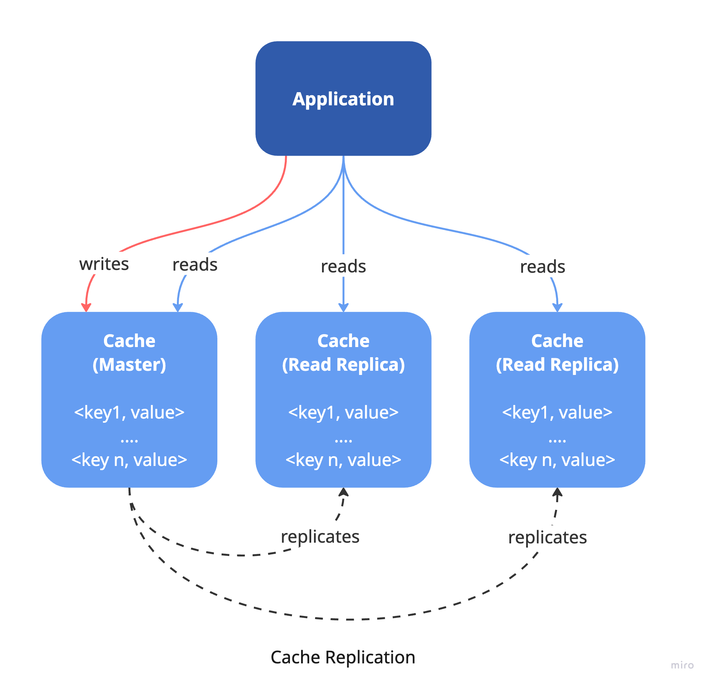
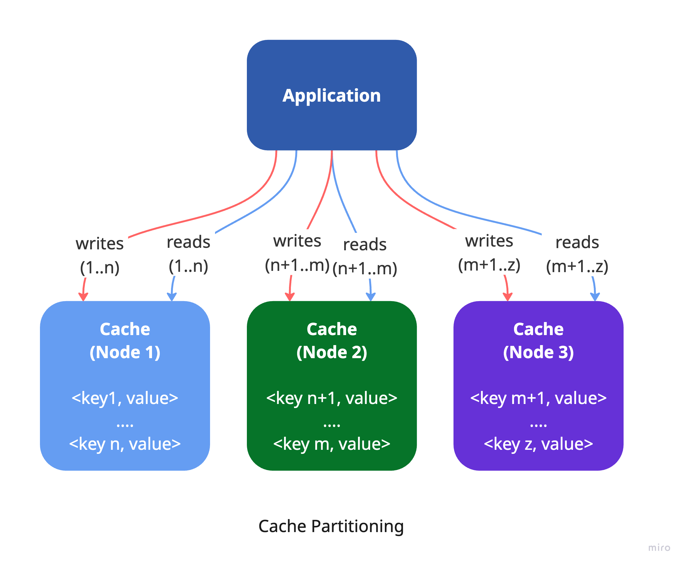
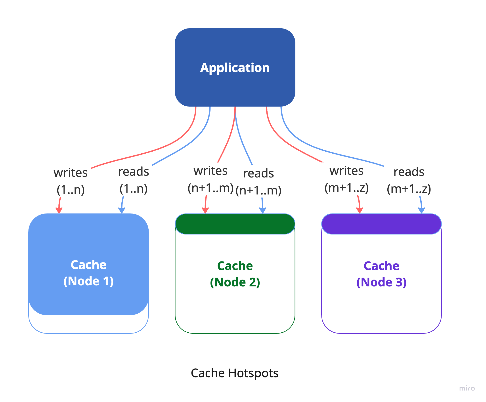
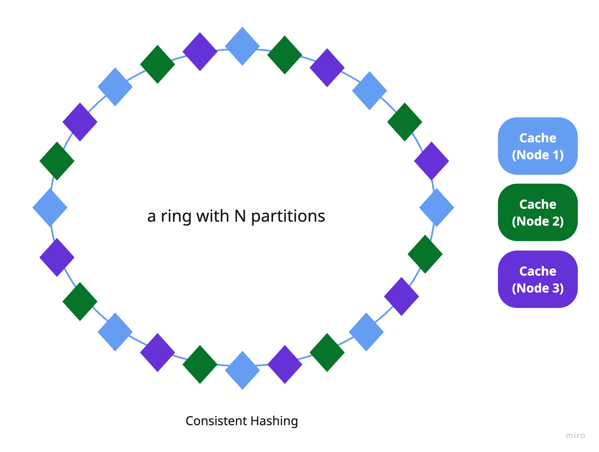
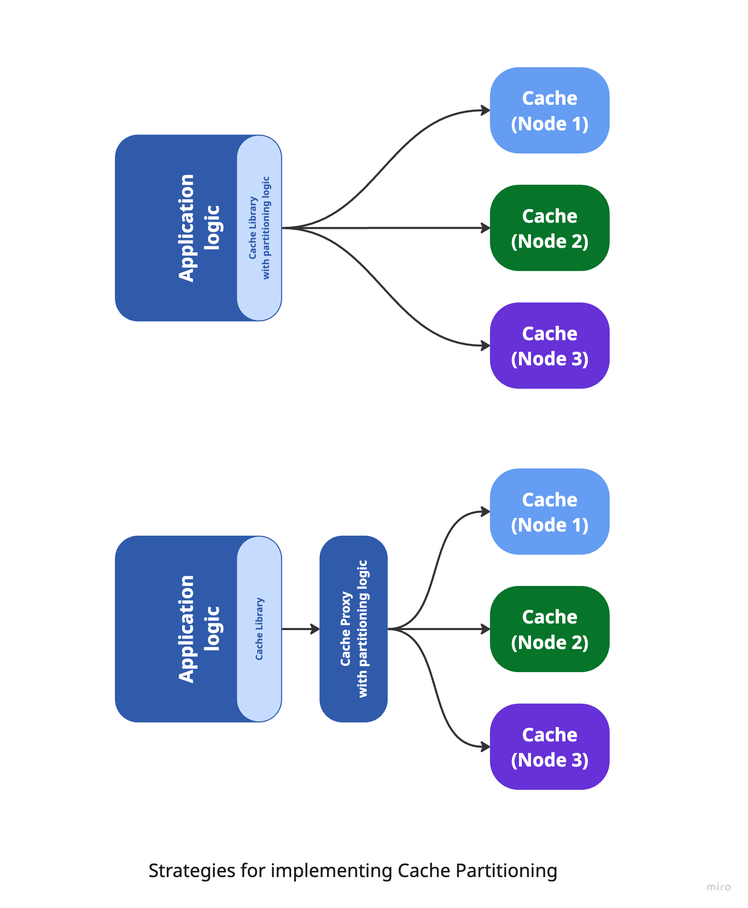

This is the first post in a blog series exploring cache partitioning strategies for distributed systems. It covers how to handle large data volumes and high traffic efficiently by dividing cache responsibilities across nodes. The post highlights why partitioning matters, compares it with replication, and explains core techniques like consistent hashing for load balancing. In upcoming articles ([Part 2](https://handsonarchitects.com/blog/2025/partitioning-of-key-value-data-in-cache-systems-part-2/), [Part 3](https://handsonarchitects.com/blog/2025/partitioning-of-key-value-data-in-cache-systems-part-3/)), we’ll look at how to decouple the caching proxy from application logic and conclude with a hands-on example of using the sidecar pattern with Twemproxy.

## When to use cache partitioning

Replicating cache data is a widely used approach to achieve high availability and fault tolerance. It involves storing identical data across multiple cache nodes (replicas), which improves read performance and ensures redundancy in case a node fails. However, for applications with large datasets or high traffic, replication alone may not be enough. That’s where cache partitioning becomes essential.

Cache partitioning involves breaking the cached data into smaller, more manageable segments (partitions) and distributing them across several cache nodes (shards). Each shard holds only a portion of the entire dataset, enabling the system to scale both read and write operations across multiple instances. Since each shard uses its own memory, disk, and CPU resources, this leads to more efficient resource usage and improved performance. The primary goal of cache partitioning is to enhance scalability.

This approach is often used in distributed systems, where multiple application instances share the cache while remaining stateless and decoupled. However, it can also be valuable in monolithic systems that require high-performance or large-capacity caching within a single application instance.

## How to distribute cache keys across multiple instances

In an ideal scenario, each cache instance would manage an equal portion of the total cache data, ensuring efficient use of resources and consistent performance. Theoretically, as you add more cache instances, overall performance should scale linearly—doubling the instances should double the throughput. However, in real-world systems, achieving this perfect balance is difficult. Disparities in data distribution often lead to uneven load across cache nodes, a problem known as cache hotspots.

When cache keys aren't evenly distributed, some instances can become overloaded while others remain underutilized. This imbalance causes performance issues such as higher latency, lower throughput, and reduced system efficiency. A common partitioning method, mod-N hashing, which uses the modulo operation to assign keys - can create skewed distributions when the key space isn't uniform, concentrating traffic on certain instances.

To address this, consistent hashing offers a more effective solution. It arranges cache instances on a virtual hash ring and assigns keys in a way that balances the load more evenly, regardless of the key space. This method significantly reduces the disruption caused by adding or removing cache instances, since only a small number of keys need to be reassigned. You can read more about consistent hashing in the [Consistent hashing algorithm](https://highscalability.com/consistent-hashing-algorithm/).

Consistent hashing is a key technique used in distributed caching systems like Memcached and Redis, often implemented via tools like Ketama, to support efficient and scalable cache partitioning.

## How to decouple cache partitioning from application logic

The application’s logic should remain decoupled from the cache partitioning mechanism. In other words, the application shouldn’t need to know how the cache is segmented or how keys are distributed among instances. Instead, the caching proxy layer should abstract away these details, presenting a unified interface that makes the cache appear as a single, cohesive system.

This abstraction can be achieved using a client library that supports consistent hashing - such as Ketama for Memcached - or by introducing a proxy layer between the application and the cache. The proxy-based approach provides greater flexibility and scalability, as it can dynamically adapt to changes in the cache topology (e.g., scaling nodes up or down) without requiring any modifications to the application code. It also enables switching partitioning strategies seamlessly, making it easier to evolve the system in response to shifting performance demands. We'll explore this in more detail in the next article.

## Conclusion

In the next two articles of this series, we’ll dive deeper into designing a scalable caching layer in distributed systems.

The second article ([Part 2](https://handsonarchitects.com/blog/2025/partitioning-of-key-value-data-in-cache-systems-part-2/)) will trace the evolution of caching implementations—from a basic in-app caching library, to an externalized sidecar (ambassador) container, and finally to a dedicated proxy layer. This progression highlights how decoupling caching concerns improves scalability, flexibility, and maintainability.

The final article ([Part 3](https://handsonarchitects.com/blog/2025/partitioning-of-key-value-data-in-cache-systems-part-3/)) will present a hands-on example using Twemproxy (Nutcracker) as a sidecar caching proxy. We’ll show how to deploy it within a Kubernetes environment alongside your application and configure it with Memcached and Ketama hashing to enable consistent, efficient cache partitioning.