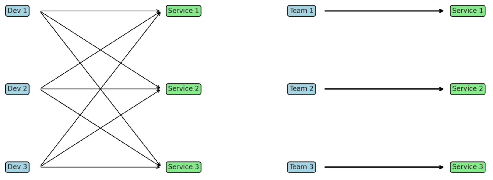

Moving from monolith to services architecture changes not only how systems are built, but above all the way teams work together. One of the most important principles to get right soon is ownership. Without clear ownership, services can quickly turn into hard to change, harder to scale and painful to operate distributed monoliths.

## Why Ownership Matters

When a new service is created, we strongly recommend defining its clear owner from day one. Ownership is not only about maintaining code.
It is about accountability for decisions, quality and the long-term health of the service but also about empowering teams to move fast.

Clearly defined ownership helps to:

- Reduce unnecessary coordination between teams.
- Align accountability with decision making power.
- Increase autonomy and allow teams to deliver features faster.
- Maintain quality and consistency over time.

### The Software Architect’s Perspective

From an architect’s viewpoint, ownership means teams are empowered to make decisions without waiting for "architectural sign-off". The architect does not become a bottleneck but instead acts as a guide and supporter:

- **Decision-making remains with the team**, especially senior developers who best understand the service internals.
- **The architect enables alignment**, ensuring that local decisions still fit into the big picture.
- **Support is always available**: architects should make time to coach, review, and unblock teams when needed.

Balancing these aspects is not easy but it allows teams to move fast with confidence while architects ensure consistency, long-term sustainability and system coherence.

## Core Principles of Code Ownership

### 1. Strong Ownership vs. Collective Ownership

- **Collective ownership** assumes any developer can work on any part of the system. While appealing in theory, it often breaks down in organizations with limited services experience. It leads to inconsistent standards, quick hacks and lack of accountability.
- **Strong ownership** means each service has a clear owner (preferably a team, not an individual). The owning team decides on coding standards, technology choices, deployment schedules, and operational practices. This autonomy reduces dependencies and improves productivity. As the number of services grows, strong ownership prevents coordination overhead from getting out of control.

As Sam Newman and James Lewis note: _services buy you options_. Strong ownership ensures those options are used intentionally, not chaotically.

### 2. Ownership and Roadmaps

A service-owning team should control its backlog and roadmap. This helps prevent short-term fixes that block future improvements. Ownership is not only about fixing bugs. It is about deeply understanding the service from both a technical and business perspective and keeping it healthy over time (e.g., finding enough time to reduce technical debt).

### 3. Developer Experience as a Foundation

Ownership also means responsibility for making services easy to develop, test and run. As services multiply, running a full system locally becomes harder. Investing early in developer platforms, starter repositories, or lightweight local environments (e.g., Docker Compose stack) is crucial. Teams that neglect developer experience will struggle with productivity and morale.

## Team Structures and Boundaries

Drawing on _Team Topologies_, ownership works best when aligned with clear team boundaries:

- **Stream-aligned teams** should own services end-to-end, from feature design to deployment and operations.
- **Platform teams** provide the tools and infrastructure to support ownership, ensuring consistency in CI/CD, observability and local development.

In smaller organizations, stream-aligned teams may dedicate members to platform-like responsibilities. Encourage those naturally interested in tooling and give them explicit time to improve it.

Each stream-aligned team should have full lifecycle responsibility for its services: from code to production metrics. That lets to significantly reduce feedback loops between users and developers.
Clear boundaries reduce friction. When teams own services, they can focus on delivering business value without waiting for permission or external coordination.

## Common Pitfalls

1. **No Ownership at All**  
   Services created without clear ownership quickly become abandoned, leading to quality and operational issues.

2. **Overlapping or Shared Ownership**  
   If multiple teams "share" ownership, accountability is diluted. Problems often fall into gaps between teams.

3. **Neglecting Developer Experience**  
   As systems grow beyond a few services, developer experience becomes critical. Without investment, onboarding slows, testing is painful, and productivity drops.

4. **Platform Too Late**  
   If you expect to grow from a handful of services to dozens, invest in a common platform early. Retrofitting standards later is far more expensive.

## Recommendations for Practitioners

- **Assign ownership from day one** for every new service. If your codebase has a shared library, make sure it has a clear owner too.
- **Prefer strong ownership**: let teams own standards, deployments, and technology choices where possible.
- **Align ownership with team boundaries** following *Team Topologies* guidance.
- **Invest in developer experience early**, even if it means dedicating partial resources.
- **Ensure each team controls its roadmap**, balancing short-term delivery with long-term maintainability.
- **Document ownership explicitly** in a service catalog, repository README, GitHub Ownership file, or platform portal to avoid confusion as teams evolve.

## Closing Reflection

Services promise flexibility and speed but only if paired with the right organizational practices. Clear ownership is one of the most powerful ways to align accountability, autonomy, and quality.

Strong ownership helps teams to move fast without chaos. It reduces coordination costs, improves service quality, and makes scaling both the system and the organization sustainable.

Ownership is not a process detail but rather a cornerstone of successful service architecture.
