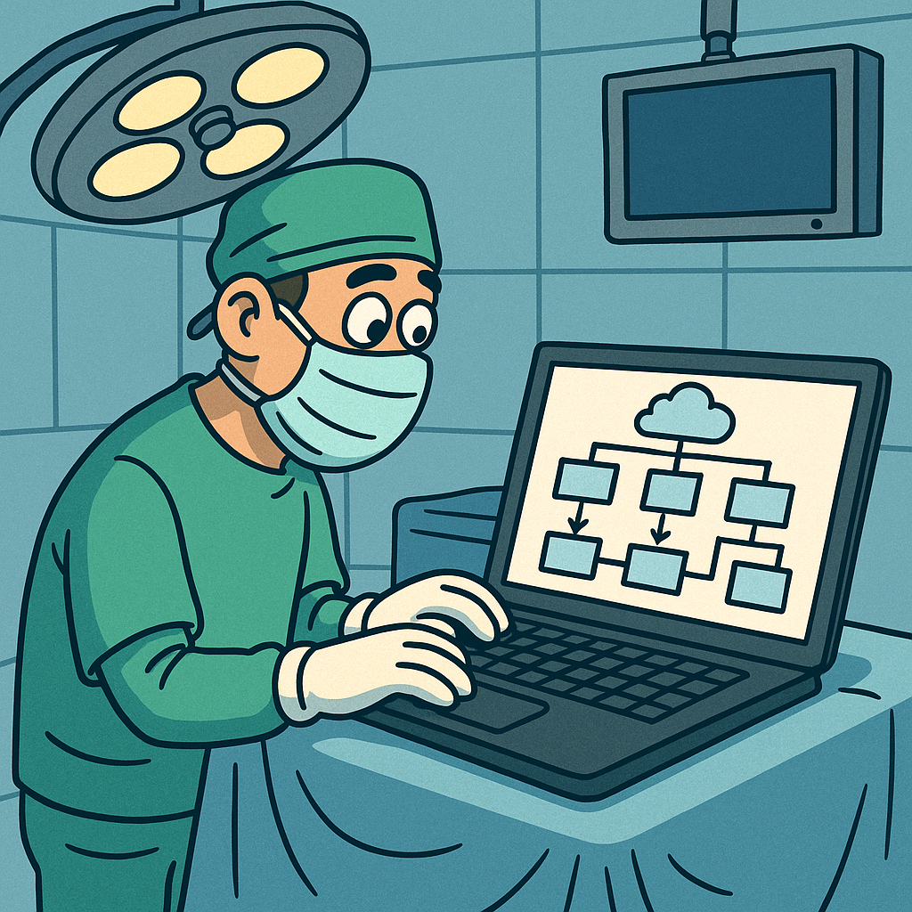

We recently watched an insightful [panel discussion on YouTube](https://youtu.be/86-Dy5U2p5Y?t=1405) featuring Daniel Terhorst-North, who compared software development to surgery. He shared a powerful thought:

> "No one wants surgery. What they want is what surgery gives them, which is to be well."

He points out clearly that people don't actually want surgery itself - they want the positive outcome surgery brings: better health or relief from illness. Similarly, our customers don't want software just for the sake of having software. Instead, they want the benefits that software provides, such as solving problems, automating tedious tasks, or improving their overall experiences.

Daniel explained that, when surgery becomes necessary, people typically want:

* **Minimal intervention**: The smallest, simplest surgery that still achieves the desired outcome.
* **Experienced surgeon**: Someone who has performed this surgery successfully many times before - no one wants to be a learning case.
* **Proven procedures**: Techniques that are well-known, tested, repeatable, and backed by evidence - not guesswork or experimentation.
* **Clear documentation**: If another surgeon needs to step in later, they should easily understand exactly what was done, why it was needed, and how it was performed.

These points translate naturally into software architecture and software development:

* **Keep solutions simple**: Deliver the smallest, simplest solution that meets your goals. Avoid unnecessary complexity.
* **Value experience**: Teams and customers benefit from working with developers and architects who have solid, hands-on knowledge of their systems.
* **Use proven methods**: Choose architectures, design patterns, frameworks, and cloud solutions with a strong track record. This reduces risks and improves reliability.
* **Document clearly**: Good documentation makes maintaining software easier, helps onboard new team members, and ensures knowledge is transferred smoothly.

## Who is the architect in this analogy?

If software developers are surgeons, then who is the software architect?

Following this analogy, **software architects** naturally play the role of experienced medical specialists or consultants. These specialists carefully plan procedures, recommend proven methods, and make sure everyone involved clearly understands what's being done, why it's necessary, and how to do it effectively.

Thinking about software architecture like surgery helps us prioritize simplicity, clarity, experience, and outcomes. It reminds us that our ultimate goal isn't building software itself - it's delivering value and benefits to users and customers.

If you're interested, we highly recommend watching the [full panel discussion on YouTube](https://youtu.be/86-Dy5U2p5Y?t=1405).
