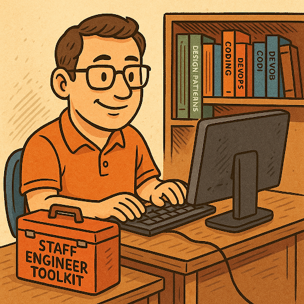

# The Staff Engineer Toolkit

> _A collection of tools, techniques, and reflections from our experience working as Staff Engineers in large-scale distributed systems and reliability-focused organizations._

## Who is a Staff Engineer?

A **Staff Engineer** is a senior individual contributor who plays a strategic technical leadership role within an organization. It’s often seen as a step up from Senior Engineer - it’s a shift from "doing more" to "thinking broader". And do not confuse it with management - Staff Engineers remain **individual contributors**, but they influence at a higher level.

You spend less time answering "how" and more time answering "why". You shape the technical direction of teams, align engineering initiatives with business goals, and guide others to deliver at scale.

Key characteristics of an effective Staff Engineer include:

- Strong **technical foundation** - deep understanding of software design, architecture, and operational excellence.
- Excellent communication skills - you collaborate across teams, departments, and sometimes entire organizations.
- Ability to **influence without authority** - you lead by trust, not by title.
- Time awareness - your most valuable resource is your **time**.
- Emotional resilience - ambiguity, imposter syndrome, and unclear expectations are part of your journey.

## Staff Engineer’s toolkit

The following sections summarize practical techniques we’ve found useful to grow and be effective in the Staff Engineer role.

### Define and evolve your leadership style

Your leadership style is shaped by your personality, values, and experiences. It determines how you influence others and drive change. Different environments reward different styles-some value hierarchical decision-making, others thrive in collaborative, experimental cultures. Be self-aware and find what aligns with your environment.

We’ve learned that collaborative, empowering leadership works best in the long run. The **organic problem-solving approach** described by Gerald M. Weinberg in "Becoming a Technical Leader" focuses on enabling and empowering others to succeed - it creates an environment where people feel valued, supported, and motivated to contribute their best work (and reduces the fear of job loss common in more hierarchical organizations). Using a threat/reward or blame culture may yield short-term results, but it often leads to burnout, low morale, and fear-driven behaviors. Moreover, it prevents innovation and risk-taking (which are essential in tech).

- Lead by influence, not authority - build trust and credibility through technical expertise and effective communication.
- Prioritize team success over individual heroics - avoid "hero culture", celebrate team wins, and share knowledge to grow together.
- Foster an environment where people feel safe to fail, learn, and share (avoid the blame game and threat/reward culture).
- Apply the **MOI Model (Motivation, Organization, Ideas)** to lead and influence others:
  - _Motivation_: understand what drives your team and align it with company goals.
  - _Organization_: navigate organizational dynamics and politics to build alliances and gain support for initiatives.
  - _Ideas_: communicate vision effectively and plant seeds of innovation.

Make sure that your leadership style aligns with your organization's culture and values. Without that alignment, even the best intentions can lead to frustration and ineffectiveness.

Recommended readings: [Becoming a Technical Leader: An Organic Problem-Solving Approach](https://www.amazon.com/Becoming-Technical-Leader-Problem-Solving-Approach/dp/0932633021/) by Gerald M. Weinberg; [Accelerate: The Science of Lean Software and DevOps: Building and Scaling High Performing Technology Organizations](https://www.amazon.com/Accelerate-Software-Performing-Technology-Organizations/dp/1942788339/) by Nicole Forsgren, Jez Humble, and Gene Kim

### Develop an architectural mindset

As a Staff Engineer, you are expected to make **architectural decisions** that balance business goals, technical trade-offs, and team capabilities. Focus on "good enough" solutions rather than perfect ones. Iterate.

- Understand your stakeholders' and sponsors' needs and constraints (business drivers, technical limitations, team capabilities).
- Break down complex problems and systems into smaller, manageable components - **build your map** to navigate complexity with your team, stakeholders, and other teams (e.g., use [C4 model](https://c4model.com/) to visualize system architecture, define system context, containers, components, and code).
- Agree on the "-ilities" (non-functional requirements) upfront to guide your architectural decisions (e.g., scalability, maintainability, performance, security) - use the [Architecture Characteristics Worksheet](https://www.developertoarchitect.com/downloads/worksheets.html) to document and align on these requirements.
- Aggregate "-ilities" into categories such as operational (e.g., performance, scalability, elasticity), structural (e.g., modularity, maintainability, testability), and cross-cutting (e.g., security, agility, deployability) to simplify decision-making and streamline discussions with stakeholders and engineering teams.
- Document architectural decisions using [ADRs (Architecture Decision Records)](https://adr.github.io/) to capture context, options considered, and rationale.

Recommended readings: [Fundamentals of Software Architecture: A Modern Engineering Approach](https://www.amazon.com/Fundamentals-Software-Architecture-Engineering-Approach/dp/1098175514/) by Mark Richards and Neal Ford; [Software Architecture: The Hard Parts: Modern Trade-Off Analyses for Distributed Architectures](https://www.amazon.com/Software-Architecture-Trade-Off-Distributed-Architectures/dp/1492086894/) by Neal Ford and Mark Richards

### Writing is thinking

It clarifies ideas, preserves decisions, and enables **asynchronous collaboration**. In remote and distributed teams, writing becomes even more critical as a communication tool.

- Capture everything that matters-designs, roadmaps, retrospectives, meeting notes.
- Use consistent templates (ADR, RFC, design doc) and always include:
  - **TL;DR** - add executive summaries to your documents to help busy stakeholders quickly grasp key points.
  - Audience - define who is expected to read it, who needs to approve it, and who should be informed.
  - **Context** - background information and relevant history.
  - Problem statement - what issue are you addressing.
  - Options considered - alternative solutions evaluated.
  - Decision rationale - why you chose this option.
  - Consequences - implications, risks, and next steps.
- Timebox your writing to avoid perfectionism and overthinking. Iterate based on feedback: check comments and questions from others, then revisit and refine your writing periodically to ensure it remains relevant and accurate.
- Consider using AI tools for summaries, crossing out mind short-cuts. E.g. run your notes through ChatGPT or Claude. Not to reformat, but to make it concise and easier to consume (READ IT AFTERWARDS!). Check our blog on [using AI for Software Architects](https://handsonarchitects.com/blog/2025/ai-toolset-for-software-architect-2025q3/).

### Build organizational awareness

In large organizations, technical skill alone is not enough - you must understand how the organization works.

- Map key stakeholders, teams, and their relationships to understand the **organizational landscape** (especially important in larger organizations where you need to navigate multiple teams and departments). You can use tools like org charts, stakeholder mapping matrices, or network diagrams to visualize these relationships.
- **Identify influencers** and decision-makers to effectively navigate organizational politics (those can be different from formal authority figures, e.g., senior engineers with strong technical credibility). Understand their motivations, goals, and pain points to build alliances and gain support for your initiatives. Start by reading their documents, adding comments, asking questions, and scheduling 1:1s to build trust over time.
- If possible, **meet people in person** - it strengthens relationships dramatically.
- Understand the company's goals, values, and culture to align your technical vision with organizational objectives (check company OKRs, your department goals, your reporting manager's goals, your team goals).
- Monitor your **reporting chains** and ensure alignment with your manager and other leaders (e.g., regular documented 1:1s, skip-level meetings, all-hands meetings).

### Learn how to learn continuously

Continuous learning is a core part of being a Staff Engineer. Think in terms of both **I-shaped skills** and **T-shaped skills**:
- **T-shaped skills** - broad knowledge across multiple areas (architecture, DevOps, cloud, security, etc.).
  - Grow as an [expert generalist](https://martinfowler.com/articles/expert-generalist.html) who can see the big picture and connect the dots between different areas.
  - Focus on "stuff you don't know you don't know" to expand your knowledge and skills beyond your current expertise (e.g., [Thoughtworks Technology Radar](https://www.thoughtworks.com/radar) for new trends and technologies - what's new, what's coming, what to try, what to hold back on).
  - Start your day with a cup of coffee/tea and 15 minutes of reading technical articles and blogs (e.g., [InfoQ](https://www.infoq.com/), [DZone Refcards](https://dzone.com/refcardz), [HandsOnArchitects](https://handsonarchitects.com/) 😉).
- **I-shaped skills** - deep expertise in a specific domain (backend, DevOps, reliability, etc.).
  - Become a **go-to person** for specific technical challenges - write blog posts, give talks, mentor others in your area of expertise - build your personal brand.
  - Always explore "other options" and alternatives to your preferred solutions to avoid tunnel vision (e.g., document pros and cons of different approaches), even if you are an expert in a specific area.
  - Sharpen your problem-solving skills by practicing coding challenges, system design interviews, and architecture exercises regularly (e.g., code algorithms using different data structures in various languages; practice system design interviews with peers - see "architectural katas").
  - If you lack time for coding practice, consider a dedicated weekly slot (e.g., 1–2 hours every Friday afternoon) to focus on **coding practice** and learning new technologies (timebox it; use the Pomodoro Technique to stay focused).

In the AI era, leverage AI tools to assist your learning (e.g., use [Notebook LM](https://notebooklm.google.com/) from Google to summarize articles, generate code snippets, or explain complex concepts).

And finally, transform learning into a habit - build your identity as a lifelong learner - use techniques from "Atomic Habits" by James Clear (habit stacking, environment design, tracking progress).

Recommended readings: [Designing Data-Intensive Applications: The Big Ideas Behind Reliable, Scalable, and Maintainable Systems](https://www.amazon.com/Designing-Data-Intensive-Applications-Reliable-Maintainable/dp/1449373321/) by Martin Kleppmann; [Expert Generalist](https://martinfowler.com/articles/expert-generalist.html) by Martin Fowler; [Atomic Habits: An Easy & Proven Way to Build Good Habits & Break Bad Ones](https://www.amazon.com/Atomic-Habits-Proven-Build-Break/dp/1847941842/) by James Clear

### Manage your autonomy and time

Staff Engineers have a lot of freedom - that means managing yourself well.

- Set clear boundaries and expectations with your manager and stakeholders regarding your availability and workload.
- Choose projects based on impact and alignment with your goals.
  - _"Your ‘no’ is a gift to your future self."_
  - Evaluate how a project affects your **energy**, **credibility**, **quality of life**, **social capital**, and **skills growth**.
  - Every technical skill set slowly becomes obsolete over time - invest in projects that help you grow and learn new skills (**learning by doing**, working closely with someone who is highly skilled), otherwise you may end up learning in your free time (which is hard to maintain in the long term).
- Use time blocking for "deep work", meetings, and learning (e.g., block mornings for deep work, afternoons for meetings and collaboration, and Fridays for learning and coding practice - add everything to your calendar).
- Measure and **track your "deep work"** ratio weekly - aim for 40–50% of your time.

Recommended readings: [The Staff Engineer's Path: A Guide for Individual Contributors Navigating Growth and Change](https://www.amazon.com/Staff-Engineers-Path-Individual-Contributors/dp/1098118731/) by Tanya Reilly; ["How to Manage Your Time as a Software Engineer – 5 Practical Tips and Tools"](https://handsonarchitects.com/blog/2024/how-to-manage-your-time-as-software-engineer-5-practial-tips-and-tools/) by Handson Architects; [Deep Work: Rules for Focused Success in a Distracted World](https://www.amazon.com/Deep-Work-Focused-Success-Distracted/dp/0349413681/) by Cal Newport

### Ensure effective project management and execution

Staff Engineers often lead complex, cross-team initiatives. You are responsible for predictable results.

- Define clear goals, success criteria, and priorities.
- [Use visual tools](https://handsonarchitects.com/blog/2025/effective-planning-for-sre-projects/#use-lightweight-tooling-to-visualize-the-plan) for planning and tracking progress.
- [Break work into manageable milestones](https://handsonarchitects.com/blog/2025/effective-planning-for-sre-projects/#break-down-the-work-into-milestones) with explicit risks and dependencies.
- Use asynchronous updates - dashboards, weekly summaries, short reports.
- [Iterate plans](https://handsonarchitects.com/blog/2025/effective-planning-for-sre-projects/#communicate-the-plan-and-iterate-often) based on feedback. Adapt continuously as new information emerges.

### Work effectively with your Engineering Manager

Your manager can be your best ally if you clearly define their expectations.

- Define success metrics together and review them regularly (1:1s, quarterly reviews), e.g., counting commits in performance reviews is not effective when you focus on non-coding activities like architecture, mentoring, or cross-team collaboration.
- **Clarify your role** in each project (tech lead, TPM, advisor, etc.) and define responsibilities to avoid misunderstandings (like who owns communication with stakeholders, who manages timelines, etc.).
- Communicate progress, risks, and dependencies regularly.
- Don’t wait for instructions - **shape your own path** and seek feedback proactively.

If your manager doesn’t support your growth or align with your values - find an environment that does. The right manager can make or break your Staff Engineer journey.

## Common traps

Even experienced Staff Engineers fall into these traps. Here are the ones we’ve faced ourselves:
- Unknown unknowns
  - Ambiguous problems are part of the role. Don’t rush decisions. Gather information, seek diverse perspectives, and **iterate**.
  - When in doubt, prototype or **experiment** to validate assumptions.
  - Leverage your network to fill knowledge gaps: talk to architects, domain experts, TPMs, and other stakeholders to gather insights. They can provide valuable context and help you **avoid blind spots**.
- Overengineering
  - Avoid elegant but impractical solutions. **"Good enough now" beats "perfect later."**
  - Always incrementally improve - use feedback loops to refine your designs, like with TDD or iterative architecture.
- Losing touch with coding
  - **Stay hands-on! No excuses!** Pair programming, small coding tasks, or code reviews keep your credibility, social capital, and empathy with your team.
  - Take part in hackathons, coding dojos, or internal tech initiatives to stay engaged with coding.
- Over-specialization in proprietary (organizational) tools
  - Avoid being locked into internal or vendor-specific technologies. Think in terms of transferable concepts. Think like a generalist and map your knowledge to broader concepts and technologies.
  - Check alternatives and open-source solutions to avoid vendor lock-in and ensure flexibility - this will also help you to grow your skills and stay relevant in the industry.

## Summary

> _Measure everything. Iterate often. Keep learning._

The Staff Engineer role is a rewarding path for experienced engineers who want to influence at scale without moving into management.

By cultivating architectural thinking, organizational awareness, and a strong learning habit, you can drive meaningful change across teams. The best Staff Engineers measure, iterate, and lead by example - combining technical excellence with human empathy.

Recommended resources to explore the role deeper:
- [The Staff Engineer's Path: A Guide for Individual Contributors Navigating Growth and Change](https://www.amazon.com/Staff-Engineers-Path-Individual-Contributors/dp/1098118731/) by Tanya Reilly
- [Pathfinder Engineer blog](https://pathfinderengineer.substack.com/) by Piotr Stapp, Tomasz Pęczek, and Jakub Gutkowski