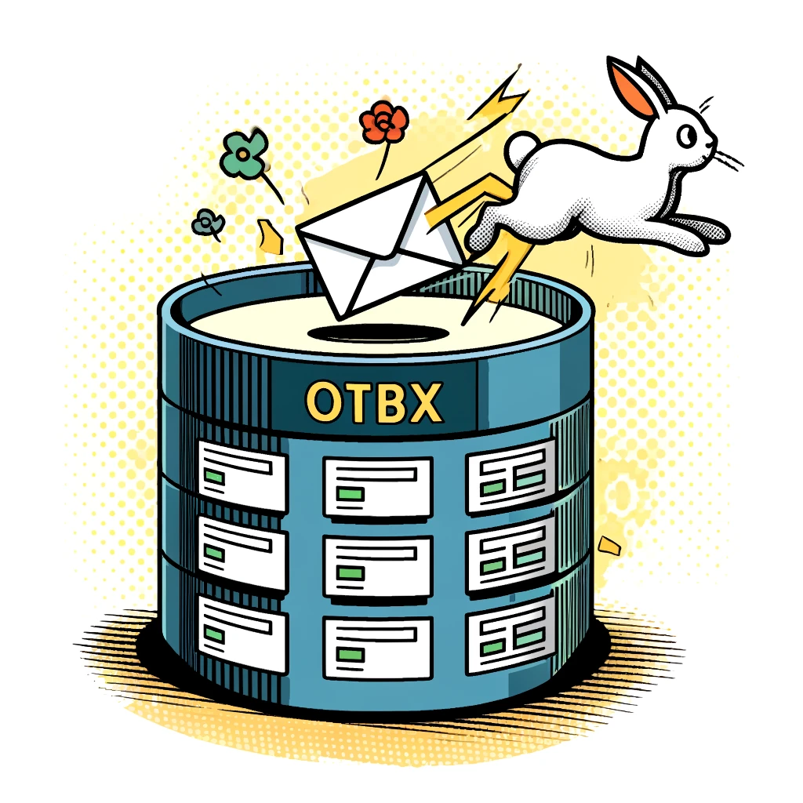
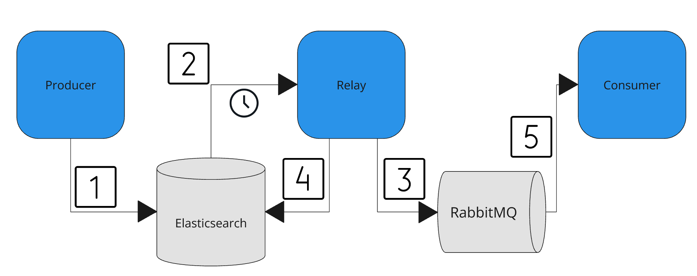

## Introduction

The Transactional Outbox Pattern is widely discussed in theory - resources like [microservices.io](https://microservices.io/patterns/data/transactional-outbox.html) provide excellent overviews of the concept. However, finding practical, code-based examples can be challenging. This pattern tackles a common challenge in distributed transactions: ensuring atomicity between database operations and message publication. In distributed systems, a failure occurring between the successful storage of data and the dispatch of an event can lead to inconsistencies. In this blog post, we present a reference implementation of the pattern using Python, RabbitMQ, and Elasticsearch. Our goal is to provide a hands-on guide that bridges the gap between theory and real-world application, particularly for those building global-scale web applications and customer experience platforms.

## Example

Our GitHub repository, [transactional-outbox-pattern-example](https://github.com/malaskowski/outbox-pattern-example), contains a complete, runnable project that demonstrates the Transactional Outbox Pattern. In this example, we simulate a simple items catalog system. When a new item is added or updated, the change needs to be propagated to other parts of the system.

The example uses:

* Python for the application logic,
* RabbitMQ as the messaging broker,
* Elasticsearch as the document database (instead of a traditional relational database).

The project is structured into three main components:

* Producer: Saves data into Elasticsearch, including an outbox property.
* Relay: Since Elasticsearch lacks built-in change data capture, a dedicated Relay component polls the database for unsent outbox entries and publishes them to RabbitMQ.
* Consumer: Listens for messages from RabbitMQ and processes the updates accordingly.

The diagram illustrates how these components interact to ensure that every data change is eventually communicated through the message broker.

## How It Works

1. **Producer Persists Data with Outbox Metadata:** The process begins when the Producer receives a request to create or update data. In a single atomic transaction, it writes the new data (document) into Elasticsearch, setting an `outbox_sent` flag to `False`.
2. **Relay Polls for Unsent Outbox Entries:** The Relay component continuously polls Elasticsearch for documents that remain unprocessed. Since Elasticsearch does not offer change data capture, this polling mechanism is essential.
3. **Relay Publishes Messages to RabbitMQ:** When the Relay finds an unprocessed document, it publishes the corresponding event to RabbitMQ.
4. **Relay Updates the Outbox Record:** After successfully sending the message (using [publisher confirms](https://www.rabbitmq.com/docs/confirms#publisher-confirms)), the Relay updates the outbox record to mark it as "sent". If an error occurs, the document remains in a pending state until the issue is resolved. If the database update fails, the outbox record is not marked as "sent", and the message is retried in the next polling cycle. This ensures at-least-once delivery semantics.
5. **Consumer Processes the Message:** The Consumer, subscribed to RabbitMQ, receives the published message. It processes the event accordingly - this could involve updating its local state, triggering business logic, or further propagating the change.

## Ensuring Consistency in Failure Scenarios

To make this as practical as possible, our repository allows you to simulate various real-world failure scenarios that the Transactional Outbox Pattern is designed to handle.

One of the challenges in distributed systems is ensuring that once data is stored in the database, it is reliably sent to the message broker. The pattern we present today addresses this challenge effectively. In our implementation, the Relay service plays a crucial role. When data is published by the Producer, it is written to Elasticsearch along with an outbox property. If the message broker becomes unavailable, the Relay detects the issue and does not mark the outbox item as "sent". Once the broker is restored, the Relay picks up all pending items and publishes them to the Consumer via RabbitMQ. This mechanism ensures that no data is lost and that all updates eventually propagate throughout the system.

You can explore additional failure scenarios, such as Producer Failure, Relay Failure, Consumer Failure, or even a Data Store Outage, by following the instructions in the repository’s README.

## Caveats and Considerations

While the Transactional Outbox Pattern is a powerful approach for maintaining consistency in distributed systems, it has its trade-offs. Here are a few considerations specific to this implementation:

* Message Ordering: The pattern does not guarantee message ordering. If order is critical, additional mechanisms are required or you may want to consider alternatives to the Transactional Outbox - “Listen to Yourself” pattern.
* Message Duplication: The pattern can lead to message duplication in some failure scenarios (due to at-least-once delivery). The Consumer should be idempotent to handle such cases.
* Resource-Intensive Polling: The Relay component continuously polls Elasticsearch for unsent outbox entries. This can be resource-intensive and may not be suitable for high-throughput systems.
* Delayed Propagation: The pattern introduces a delay between when data is written to the database and when it is processed by the Consumer. This delay can be significant depending on the polling interval, processing time, and the time it takes Elasticsearch to index the data. These factors combined may make the pattern unsuitable for real-time systems.

## Summary

In this post, we explored a hands-on example of the Transactional Outbox Pattern implemented with Python, RabbitMQ, and Elasticsearch. We explained the data flow between the Producer, Relay, and Consumer, and demonstrated the pattern's behavior in a broker failure scenario. We also discussed trade-offs and considerations to keep in mind when implementing this pattern in your own systems. We encourage you to clone the repository, experiment with the code, and consider how this pattern can enhance the resilience of your own distributed systems.
