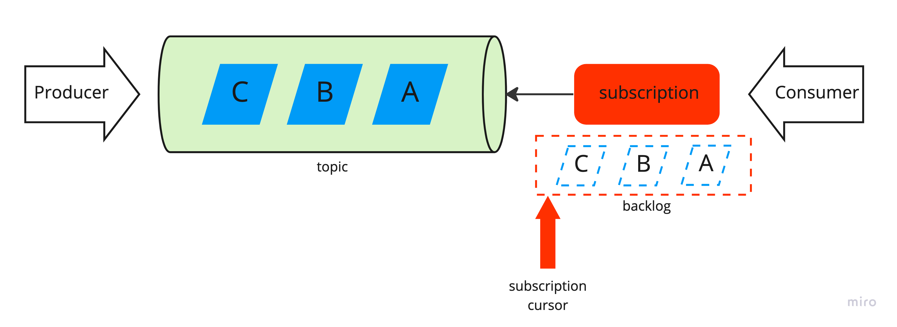
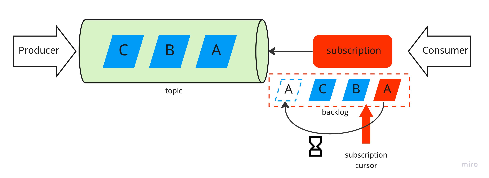

# Pulsar message order

> Be aware that negative acknowledgments on ordered subscription types, such as Exclusive, Failover and Key_Shared, might cause failed messages being sent to consumers out of the original order ([source](https://pulsar.apache.org/docs/2.11.x/concepts-messaging/)).

In this blog post, we try to explain the above sentence with two examples:
- messages are positively acknowledged and processed in sequential order (the sequence identifier is pre-assigned by the producer)
- some messages are acknowledged negatively and re-delivered with some delay.

## Positive Acknowledge

The following diagram illustrates how the consumer receives and acknowledges the messages sent by the producer. Our consumer subscribes to the `unit test` topic with the subscription type `Exclusive` and the subscription initial position `Earliest`:

```java
Consumer<String> consumer = client.newConsumer(Schema.STRING)
    .topic(topicName)
    .subscriptionName("unit-test")
    .subscriptionInitialPosition(SubscriptionInitialPosition.Earliest)
    .subscriptionType(SubscriptionType.Exclusive)
    .subscribe();
```


Then it receives unacknowledged messages (the set of unacknowledged messages is called backlog) one by one and acknowledges/confirms them:

```java
Message<String> m1 = consumer.receive();
consumer.acknowledge(m1);
Message<String> m2 = consumer.receive();
consumer.acknowledge(m2);
Message<String> m3 = consumer.receive();
consumer.acknowledge(m3);
```

The order of received messages reflects the initial (sequential) order: messages `A`, `B` and `C`:

```java
assertEquals("A", m1.getValue());
assertEquals("B", m2.getValue());
assertEquals("C", m3.getValue());
```

Each `receive` command moves the subscription cursor to the next position (from right to left). Finally, the cursor is positioned after the `C` message:



All acknowledged messages are marked for deletion. Read more about [conditions](https://pulsar.apache.org/docs/2.11.x/cookbooks-retention-expiry/) when messages are deleted from the topic.

## Negative Acknowledge

The order of messages changes when messages are acknowledged negatively. In the following scenario, the message `m1` is negatively acknowledged and rescheduled for re-delivery in the future:

```java
producer.send("A");
producer.send("B");

Message<String> m1 = consumer.receive();
consumer.negativeAcknowledge(m1);
Message<String> m2 = consumer.receive();
consumer.acknowledge(m2);
producer.send("C");
Message<String> m3 = consumer.receive();
consumer.acknowledge(m3);
Message<String> m4 = consumer.receive();
consumer.acknowledge(m4);
```

The figure below shows the above scenario:



The order of received messages for our example is:

```java
assertEquals("A", m1.getValue());
assertEquals("B", m2.getValue());
assertEquals("C", m3.getValue());
assertEquals("A", m4.getValue());
assertEquals(m1.getSequenceId(), m4.getSequenceId());
```

The consumer receives message "A" with some delay (second attempt). We can make sure it's the same message by checking its sequence ID.

## Summary
Apache Pulsar delivers messages in sequential order as long as the consumer positively acknowledges them. The message acknowledgment mechanism allows consumers to ask Pulsar to redeliver the message. The consequence is that our processing logic cannot rely on the order of the messages. When the order of messages is critical (publish/unpublish), our algorithm needs to use additional strategies, e.g. event time / sequence id, to properly handle this situation.

## References
- [MessagesOrderScenariosTest](https://github.com/handsonarchitects/sandbox/blob/main/pulsar/src/test/java/com/handsonarchitects/pulsar/MessagesOrderScenariosTest.java)