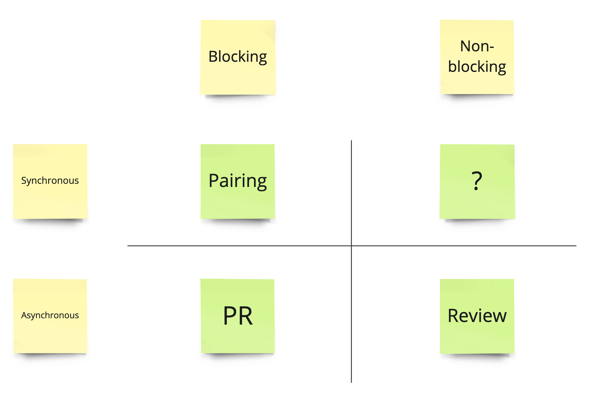
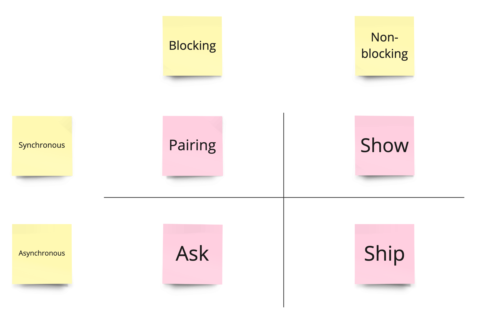

The aforementioned post [Thinking About Code Review](https://tidyfirst.substack.com/p/thinking-about-code-review) was triggered by one of the Twitter threads on CI/CD vs PRs.

The especially interesting part was _"Dimensions of Variability"_ where two dimensions of inspecting the code were mentioned: `blocking/non-blocking` vs `synchronous/asynchronous`. The original author's conclusion was:

This categorization looks really accurate. It took us only a couple of minutes of discussion to bring the [Ship / Show / Ask](https://martinfowler.com/articles/ship-show-ask.html) strategy.

When we tried to put ship/show/ask techniques into the _"Dimensions of Variability"_ we got the following result:

The quarter worth a few words is the `non-blocking` and `synchronous` one. We treat _show_ as a kind of knowledge sharing (with additional benefits like feedback on the solution/code). On the one hand, it does not block proceeding with taking the changes further. On the other hand, the session that is valuable for both sides (the audience and the presenter) is synchronous. It requires gathering in one space (physical or virtual) at one time to show and get feedback. Of course, the form could be asynchronous too. However, our previous knowledge-sharing sessions tell us that the greatest chance for the presenter to get feedback is during or just after the _show_.
