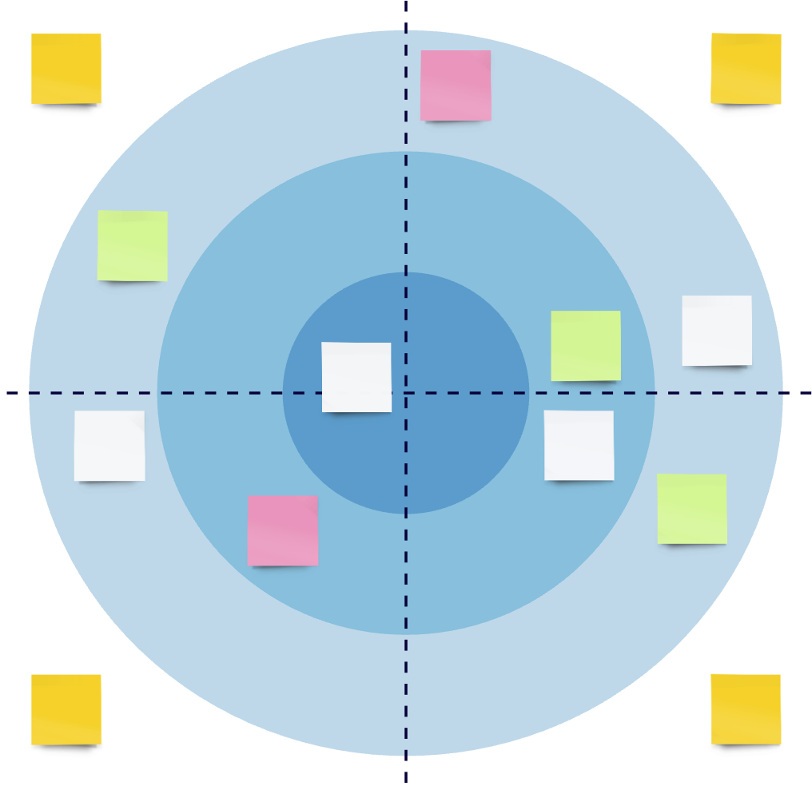

Technology Radar is a phenomenon that helps visualize the technology stack. By the technology or the technology stack, we mean not only frameworks, languages, and platforms, but also techniques, skills and everything that might be the subject of work required to deliver the software. In the Technology Radar, the particular technologies are called _blips_.

Let's dive into how the tool may help to harness the tech stack at various levels of business starting with some of the most popular definitions:

> An opinionated guide to technology frontiers

<small>source: https://www.thoughtworks.com/radar</small>

> A technology radar is a way of observing the market for new innovations and technologies and gather information about them in a consistent style, relate and evaluate them on behalf of the own business.

<small>source: https://www.igi-global.com/dictionary/technology-roadmap-living-labs/29542</small>

> technical engineering documentation that works as a portfolio for you to visualize an institution's technologies and methodologies, monitor new trends, and identify which tools need to be removed, either because the technology is legacy.

<small>source: https://dzone.com/articles/what-is-tech-radar-why-teams-need-to-have-one</small>

---

## Context is the king

Radars get more traction recently in the technologists community. As members of the community, we find it very useful to represent the technology stack at different levels, e.g. personal development, project or product technology stack, company-specific framework choices, or even industry trends.

Depending on the level, radar may represent different categories (quadrants) or priorities (rings). A specific situation we use the radar to visualize creates the **context**.

## Dimensions

As mentioned above, depending on the _context_, different metrics could be visualized on the radar. That means, that one company can have more than one radar (which often is the case). It is simple to imagine that one radar could represent the technology portfolio of the company, while another could represent the skills the company is looking for in the new candidates and the current engineering team.

However, there are some common qualities, the radar helps to understand no matter the context:

- `usefulness` - how useful we find the technology in the _context_, e.g.:
   - on the personal radar (one that helps to organize what you know and what you want to learn) it may point to what we want to learn next,
   - on the company radar, we may seek information on what conferences/workshops we should send employees to,
- `confidence` - how much do we trust (but also know) the tech, e.g.:
   - the project's radar shows that one technology is the default choice for some kind of platform services (e.g. we choose `Quarkus` over `Spring` when implementing backend services),
   - on the personal radar, placing the blip may represent our seniority in the technology or technique (e.g. we are just getting to know `Apache Kafka`, but we could lead the training in the middle of the night on adopting `Continous Integration`),
- `trends` (or `adoption`) - how widely adopted is the technology, how much did we invest in it already, is it gaining or losing popularity, e.g.:
   - the digital experience industry radar may show an increasing trend in measuring their applications footprint (e.g. clients ask more and more about the "Green Cloud"),
   - the personal radar may represent the technology we know well, but we don't want to invest in/work with anymore (e.g. we are experts in `Maven`, but it let us down so many times, that we will start new projects only using `Gradle`).

## Summary
In this article, we showcased some scenarios of working with Technology Radars. The plural form is not a coincidence. We work with the tool for several years now. We find it extremely useful because of its simplicity and depth at the same time (the separate concern is putting it together - but that's the case for another, much longer article). We are using it for personal development and adopting it in projects and companies we are working with. It is a great tool, that does not require much introduction while it shows complex things (the technology stack) in a simple and accessible form.
