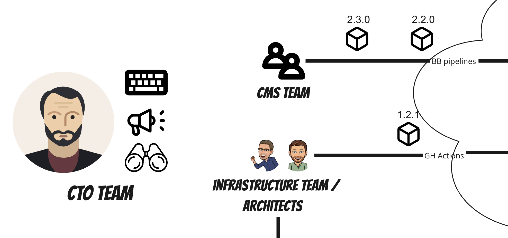
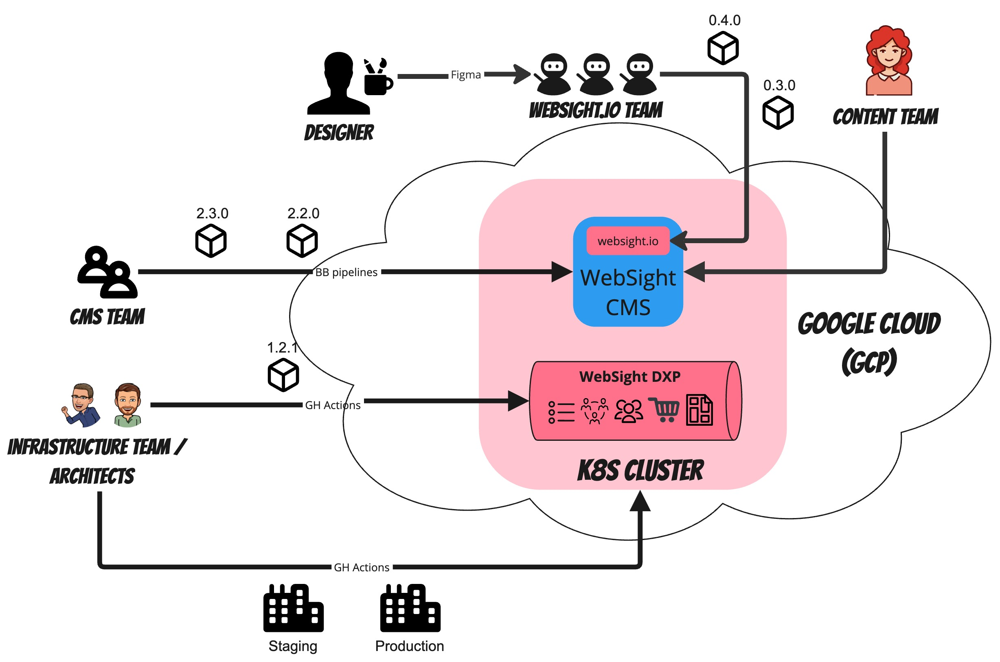

> WebSight is a unique place where software engineers can play with modern architecture, edge technologies, and fully agile development techniques (experimental development approach, trunk-based development, TDD, pair programming etc.) adequate to their experiences in small, independent teams.

We believe that it is possible to create an extraordinary and unique workplace by building self-organizing small, independent teams that communicate through well-defined contracts and responsibilities.

In this article, we want to explain how we launched a completely new website using WebSight DXP & CMS in two weeks.

## Goals
- launch new website www.websight.io in two weeks, before `Adobe Summit`
- prepare materials, use cases and basic principles for WebSight DXP
- test a new project, the WebSite DXP event streaming platform, in a production environment on Google Cloud Platform

Here are our assumptions for all teams:
- one overarching goal for all teams (both business and engineering)
- self-managed and fully isolated teams define their internal plans and criteria for success
- simultaneous development and content entry
- teams of engineers continuously create production-ready versions and independently deploy them to production

## Teams
- WebSight CMS team (mainly senior back-end engineers) used a simplified SDLC process to deliver a new publishing engine with limited code review, highly functional test automation (e2e)
- www.websight.io CMS component development team managed by Project Manager using standard GIT flow, limited quality gates, with dedicated Release Manager role and manual testing phases
- designer who created UI designs for all sites
- content authors/information architects focused on site structure and content entry
- infrastructure team (DevOps) using techniques such as trunked development, infrastructure as code, ephemeral environments, deployment automation, etc.
- hands-on architects using test-driven development, pair development, and experimental development approaches to ensure platform performance and high availability
- CTO who kept priorities unchanged within two weeks...

The diagram below presents how all teams worked together:

It is worth noting that there are no managerial roles at the team integration level in the above arrangement. Thanks to properly defined contracts, frequent releases, independent staging/production deployments and limited, results-oriented communication, we were able to quickly combine the results of the teams' work and move very quickly.

## Summary

The ability to build small, agile teams with limited bureaucracy is crucial for projects that aspire to conquer the market. Building such open work culture is based on strong trust and high professionalism. The transformation is ongoing, but we can already see the effects.